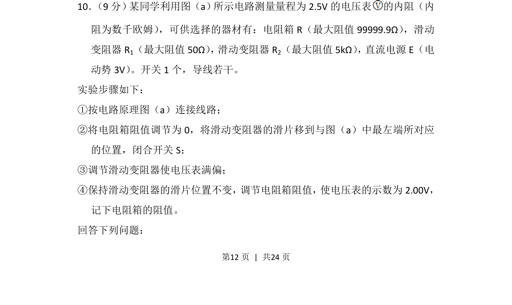
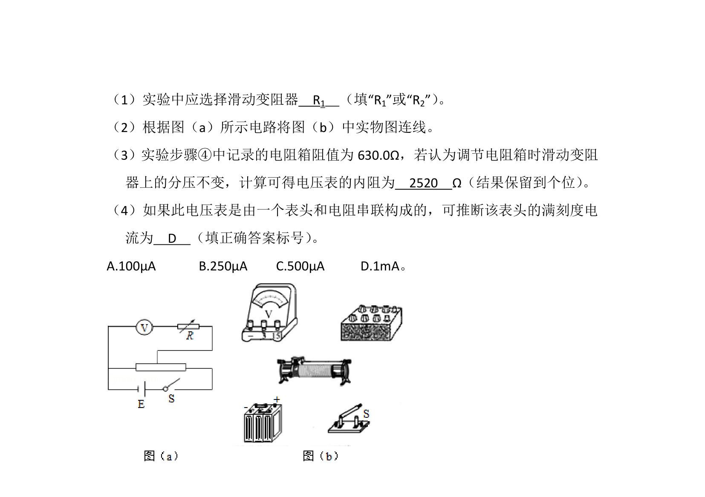
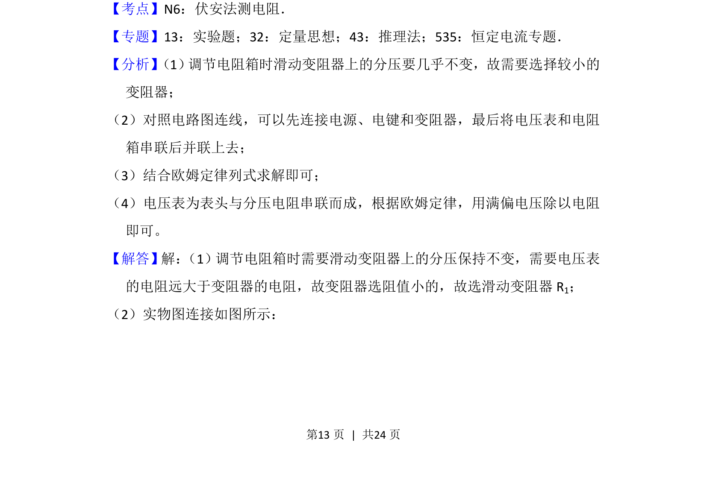
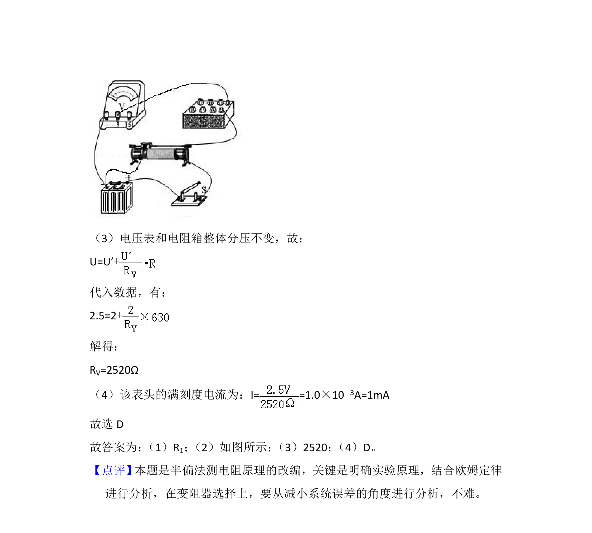

## 题面

## 摘要

利用半偏法测量电压表内阻，考查分压电路与闭合电路欧姆定律的应用。

## 关联考点

- [[546-半偏法|半偏法]]
- [[771-电压表内阻|电压表内阻]]
- [[332-闭合电路欧姆定律|闭合电路欧姆定律]]
- [[762-分压接法|分压接法]]

## 答案与解析

> 📄 原 PDF 第 12 页：`素材/真题/吉林/2008-2024·（吉林）物理高考真题/2016年高考物理试卷（新课标Ⅱ）（解析卷）.pdf`

<!-- 题干文本-start -->
## 题干文本
10． （9分） 某同学利用图（a） 所示电路测量量程为2.5V的电压表 的内阻（内
阻为数千欧姆） ，可供选择的器材有：电阻箱R（最大阻值99999.9Ω） ，滑动
变阻器R 1（最大阻值50Ω） ， 滑动变阻器R2（最大阻值5kΩ） ， 直流电源E（电
动势3V） 。开关1个，导线若干。
实验步骤如下：
①按电路原理图（a）连接线路；
②将电阻箱阻值调节为0，将滑动变阻器的滑片移到与图（a）中最左端所对应
的位置，闭合开关S；
③调节滑动变阻器使电压表满偏；
④保持滑动变阻器的滑片位置不变， 调节电阻箱阻值， 使电压表的示数为2.00V，
记下电阻箱的阻值。
回答下列问题：
<!-- 题干文本-end -->

<!-- 解析文本-start -->
## 解析文本

<!-- 解析文本-end -->
