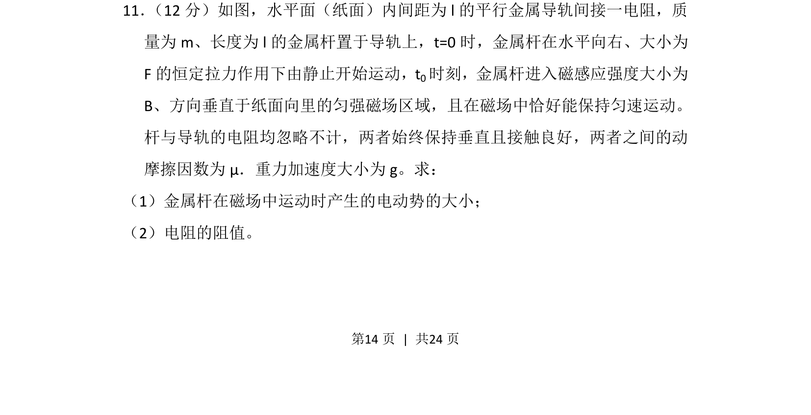
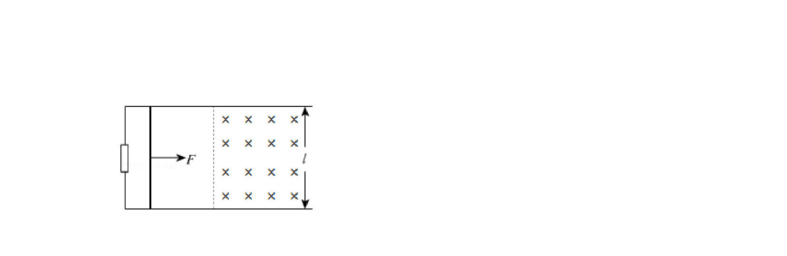
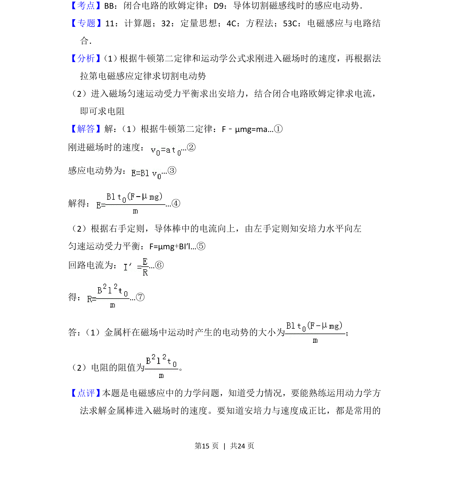

## 题面

## 摘要

金属杆在恒定拉力和摩擦力作用下先匀加速后进入磁场匀速运动，考查电磁感应与电路综合。

## 关联考点

- [[动生电动势]]
- [[332-闭合电路欧姆定律|闭合电路欧姆定律]]
- [[受力平衡]]
- [[215-匀变速直线运动|匀变速直线运动]]

## 答案与解析

> 📄 原 PDF 第 14 页：`素材/真题/吉林/2008-2024·（吉林）物理高考真题/2016年高考物理试卷（新课标Ⅱ）（解析卷）.pdf`
