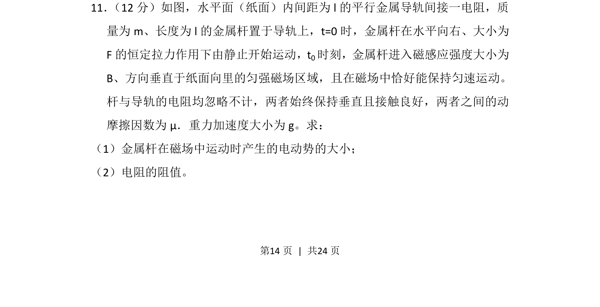
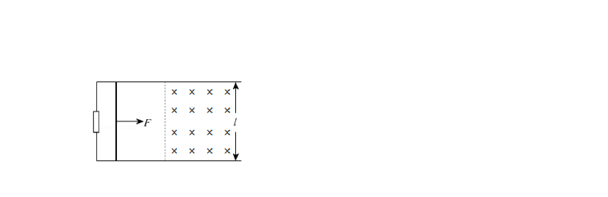
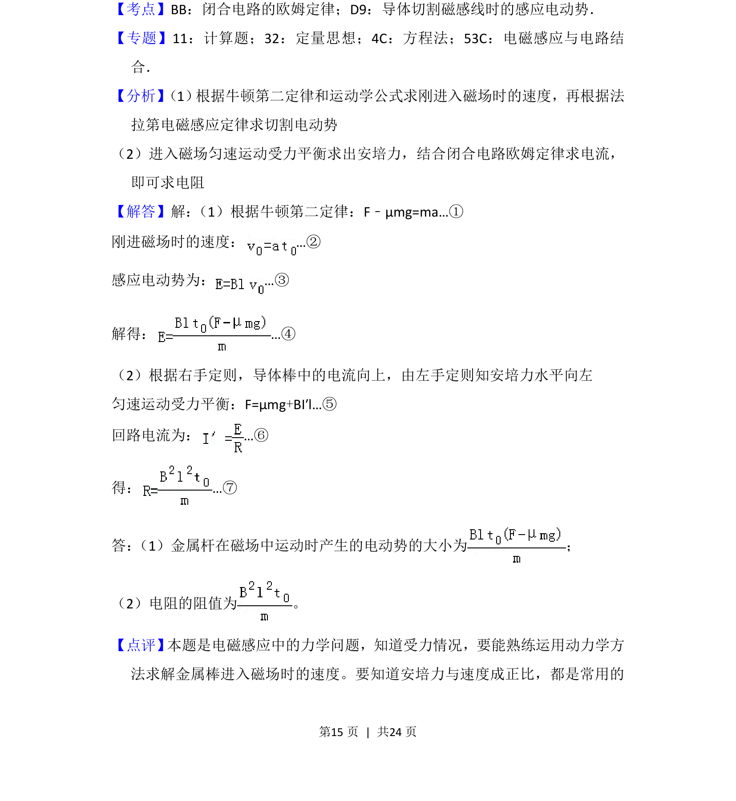

## 题面

## 摘要

金属杆在恒定拉力和摩擦力作用下先匀加速后进入磁场匀速运动，考查电磁感应与电路综合。

## 关联考点

- [[538-动生电动势|动生电动势]]
- [[332-闭合电路欧姆定律|闭合电路欧姆定律]]
- [[554-受力平衡|受力平衡]]
- [[215-匀变速直线运动|匀变速直线运动]]

## 答案与解析

> 📄 原 PDF 第 14 页：`素材/真题/吉林/2008-2024·（吉林）物理高考真题/2016年高考物理试卷（新课标Ⅱ）（解析卷）.pdf`

<!-- 题干文本-start -->
## 题干文本
11． （12分）如图，水平面（纸面）内间距为l的平行金属导轨间接一电阻，质
量为m、长度为l的金属杆置于导轨上，t=0时，金属杆在水平向右、大小为
F的恒定拉力作用下由静止开始运动，t 0时刻，金属杆进入磁感应强度大小为
B、方向垂直于纸面向里的匀强磁场区域，且在磁场中恰好能保持匀速运动。
杆与导轨的电阻均忽略不计，两者始终保持垂直且接触良好，两者之间的动
摩擦因数为μ．重力加速度大小为g。求：
（1）金属杆在磁场中运动时产生的电动势的大小；
（2）电阻的阻值。
<!-- 题干文本-end -->

<!-- 解析文本-start -->
## 解析文本

<!-- 解析文本-end -->
