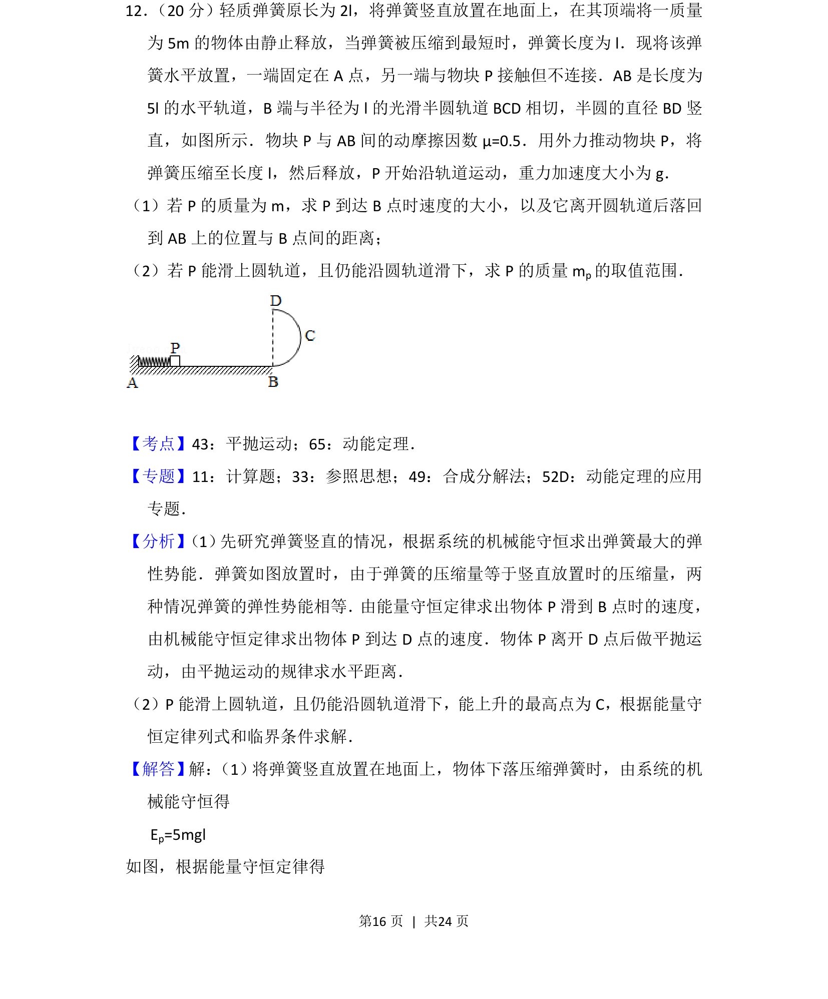

## 题面

## 摘要

该题考查弹簧弹性势能与圆周运动、平抛运动结合的综合问题，涉及临界条件分析。

## 关联考点

- [[261-平抛运动|平抛运动]]
- [[251-动能定理|动能定理]]
- [[085-机械能守恒-初中|机械能守恒定律]]
- [[圆周运动临界条件]]

## 答案与解析

> 📄 原 PDF 第 16 页：`素材/真题/吉林/2008-2024·（吉林）物理高考真题/2016年高考物理试卷（新课标Ⅱ）（解析卷）.pdf`
