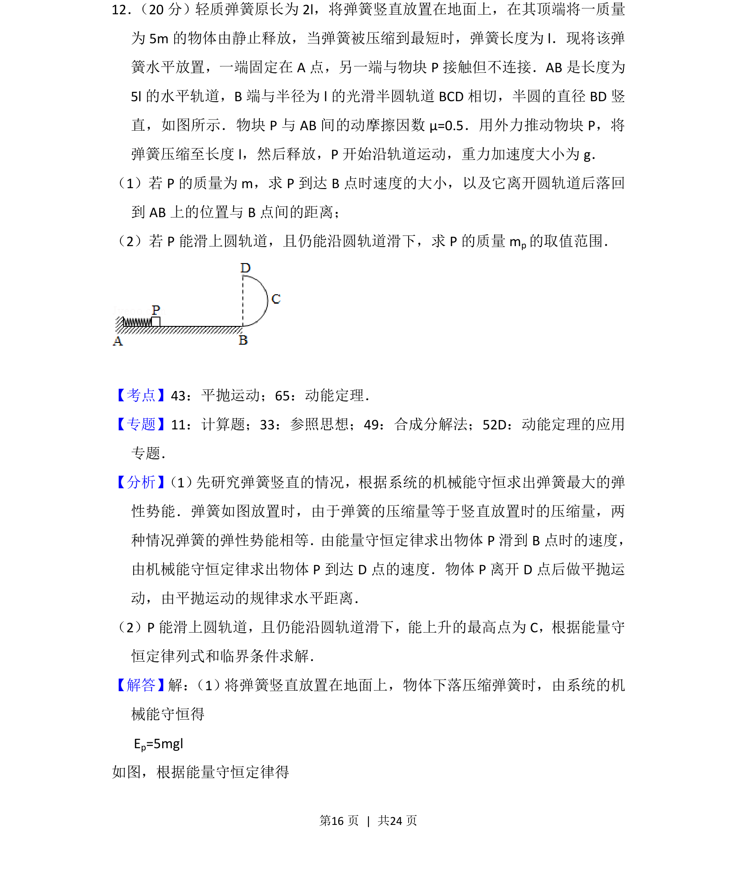
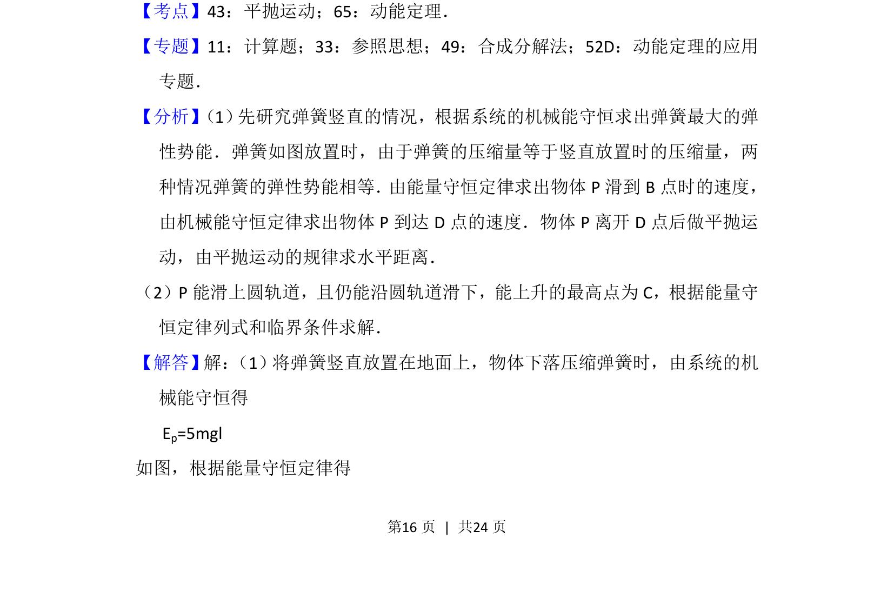
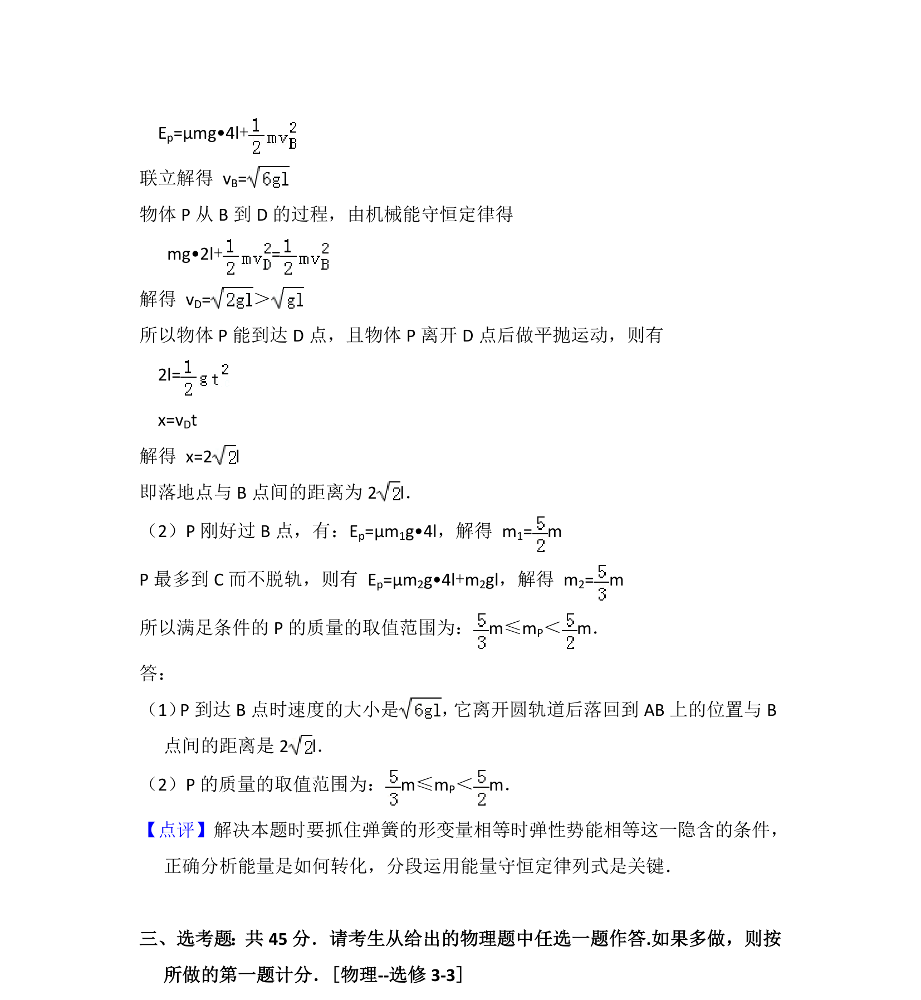

## 题面

## 摘要

该题考查弹簧弹性势能与圆周运动、平抛运动结合的综合问题，涉及临界条件分析。

## 关联考点

- [[261-平抛运动|平抛运动]]
- [[251-动能定理|动能定理]]
- [[085-机械能守恒-初中|机械能守恒定律]]
- [[465-圆周运动临界条件|圆周运动临界条件]]

## 答案与解析

> 📄 原 PDF 第 16 页：`素材/真题/吉林/2008-2024·（吉林）物理高考真题/2016年高考物理试卷（新课标Ⅱ）（解析卷）.pdf`

<!-- 题干文本-start -->
## 题干文本
12． （20分）轻质弹簧原长为2l，将弹簧竖直放置在地面上，在其顶端将一质量
为5m的物体由静止释放，当弹簧被压缩到最短时，弹簧长度为l．现将该弹
簧水平放置，一端固定在A点，另一端与物块P接触但不连接．AB是长度为
5l的水平轨道，B端与半径为l的光滑半圆轨道BCD相切，半圆的直径BD竖
直，如图所示．物块P与AB间的动摩擦因数μ=0.5．用外力推动物块P，将
弹簧压缩至长度l，然后释放，P开始沿轨道运动，重力加速度大小为g．
（1）若P的质量为m，求P到达B点时速度的大小，以及它离开圆轨道后落回
到AB上的位置与B点间的距离；
（2）若P能滑上圆轨道，且仍能沿圆轨道滑下，求P的质量m p的取值范围．
<!-- 题干文本-end -->

<!-- 解析文本-start -->
## 解析文本
【考点】43：平抛运动；65：动能定理．菁优网版权所有
【专题】11：计算题；33：参照思想；49：合成分解法；52D：动能定理的应用
专题．
【分析】 （1） 先研究弹簧竖直的情况，根据系统的机械能守恒求出弹簧最大的弹
性势能．弹簧如图放置时，由于弹簧的压缩量等于竖直放置时的压缩量，两
种情况弹簧的弹性势能相等． 由能量守恒定律求出物体P滑到B点时的速度，
由机械能守恒定律求出物体P到达D点的速度．物体P离开D点后做平抛运
动，由平抛运动的规律求水平距离．
（2）P能滑上圆轨道，且仍能沿圆轨道滑下，能上升的最高点为C，根据能量守
恒定律列式和临界条件求解．
【解答】解： （1）将弹簧竖直放置在地面上，物体下落压缩弹簧时，由系统的机
械能守恒得
   E p=5mgl
如图，根据能量守恒定律得
<!-- 解析文本-end -->
