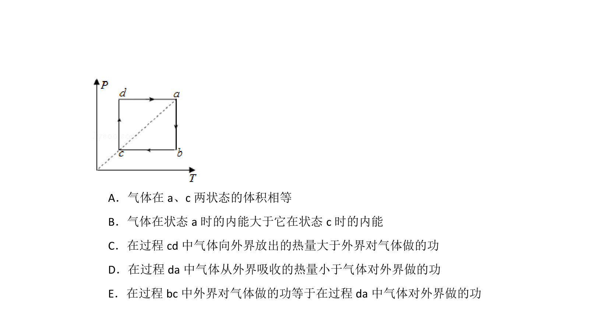
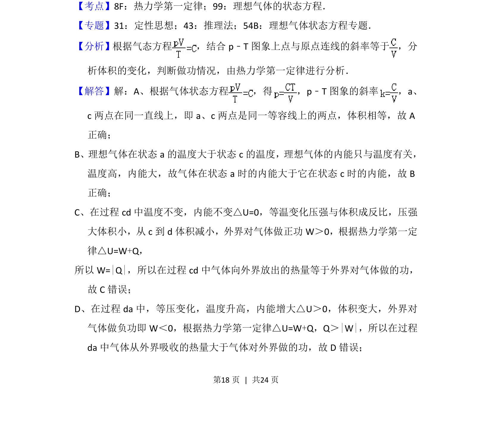
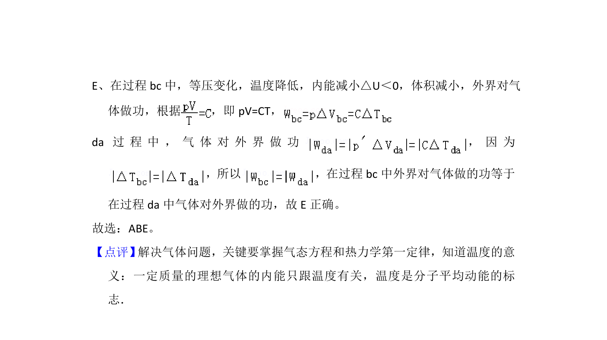

## 题面

## 摘要

利用P-T图像分析理想气体的等温、等压循环过程，判断各过程参量变化及热力学定律应用。

## 关联考点

- [[446-理想气体状态方程|理想气体状态方程]]
- [[热力学过程分析]]
- [[P-T图像]]
- [[440-热力学第一定律|热力学第一定律]]

## 答案与解析

> 📄 原 PDF 第 17 页：`素材/真题/吉林/2008-2024·（吉林）物理高考真题/2016年高考物理试卷（新课标Ⅱ）（解析卷）.pdf`
