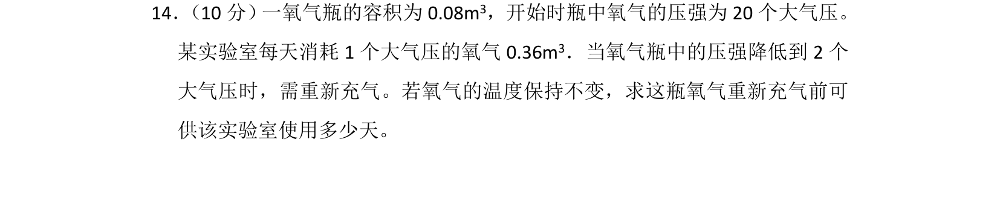
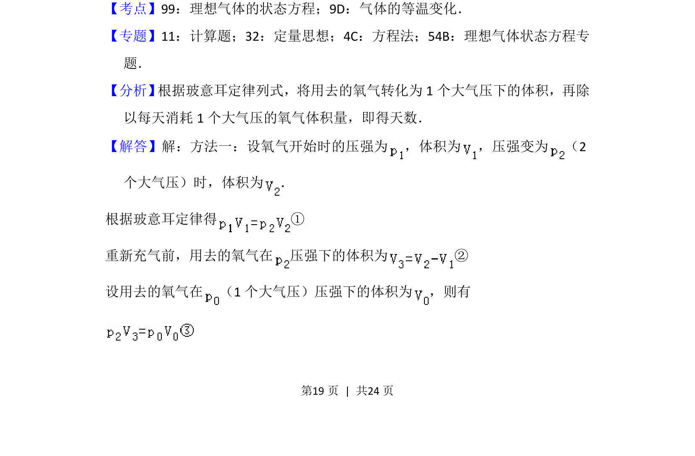
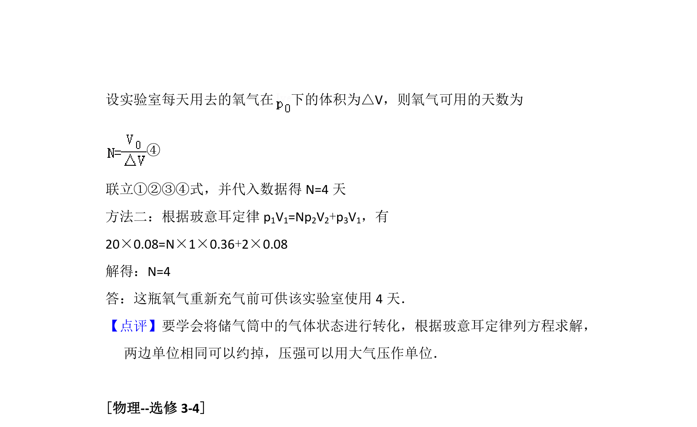

## 题面

## 摘要

利用玻意耳定律计算氧气瓶在等温条件下重新充气前可供使用的天数。

## 关联考点

- [[446-理想气体状态方程|理想气体的状态方程]]
- [[640-气体的等温变化|气体的等温变化]]
- [[444-玻意耳定律|玻意耳定律]]

## 答案与解析

> 📄 原 PDF 第 19 页：`素材/真题/吉林/2008-2024·（吉林）物理高考真题/2016年高考物理试卷（新课标Ⅱ）（解析卷）.pdf`

<!-- 题干文本-start -->
## 题干文本
14． （10分） 一氧气瓶的容积为0.08m3，开始时瓶中氧气的压强为20个大气压。
某实验室每天消耗1个大气压的氧气0.36m 3．当氧气瓶中的压强降低到2个
大气压时，需重新充气。若氧气的温度保持不变，求这瓶氧气重新充气前可
供该实验室使用多少天。
<!-- 题干文本-end -->

<!-- 解析文本-start -->
## 解析文本
【考点】99：理想气体的状态方程；9D：气体的等温变化．菁优网版权所有
【专题】11：计算题；32：定量思想；4C：方程法；54B：理想气体状态方程专
题．
【分析】 根据玻意耳定律列式，将用去的氧气转化为1个大气压下的体积，再除
以每天消耗1个大气压的氧气体积量，即得天数．
【解答】解：方法一：设氧气开始时的压强为 ，体积为 ，压强变为 （2
个大气压）时，体积为 ．
根据玻意耳定律得 ①
重新充气前，用去的氧气在 压强下的体积为 ②
设用去的氧气在 （1个大气压）压强下的体积为 ，则有
<!-- 解析文本-end -->
