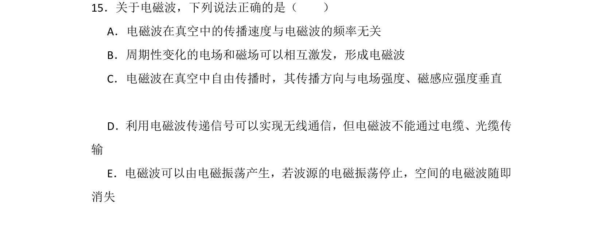
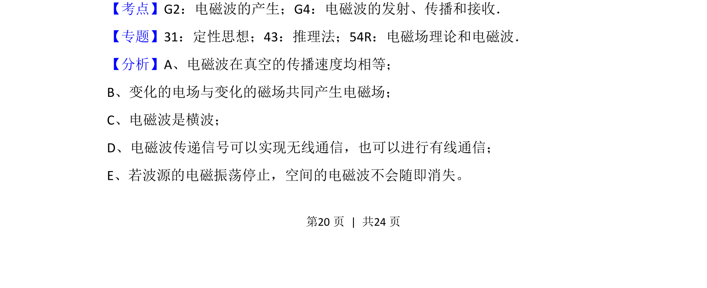
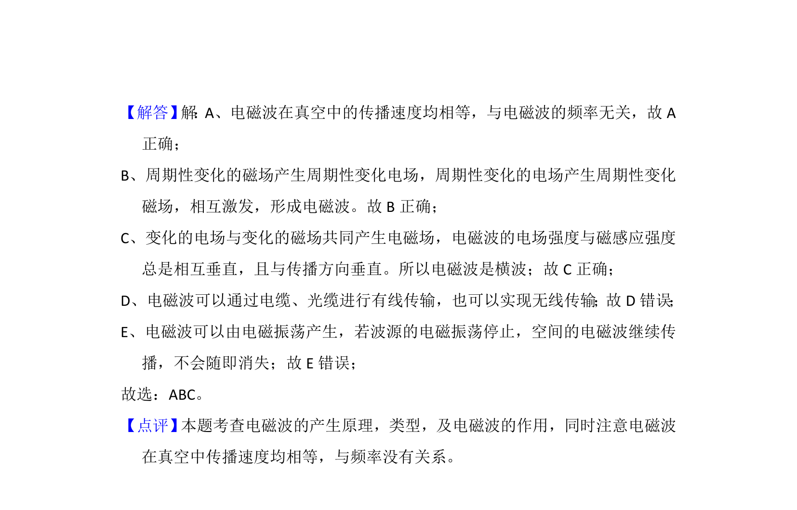

## 题面

## 摘要

该题考查电磁波的基本性质，包括产生机制、传播特性及传输方式。

## 关联考点

- [[687-电磁波的产生|电磁波的产生]]
- [[486-电磁波的传播|电磁波的传播]]
- [[688-电磁波的接收|电磁波的接收]]

## 答案与解析

> 📄 原 PDF 第 20 页：`素材/真题/吉林/2008-2024·（吉林）物理高考真题/2016年高考物理试卷（新课标Ⅱ）（解析卷）.pdf`
