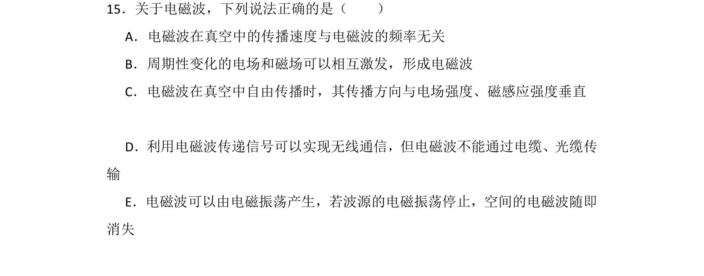
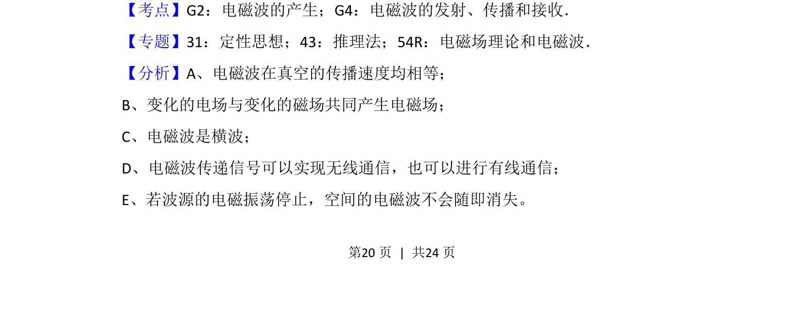
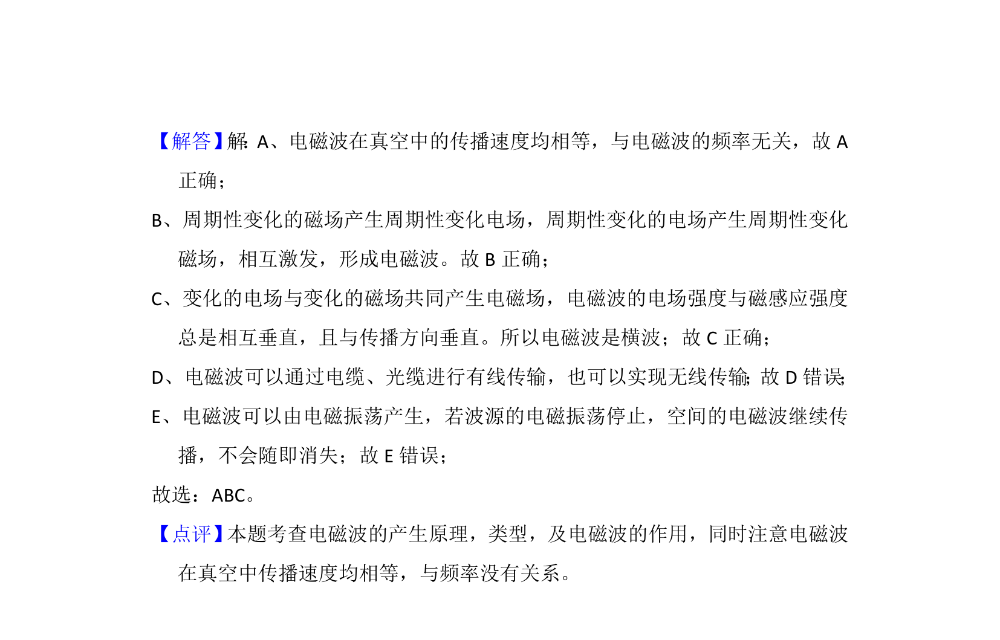

## 题面

## 摘要

该题考查电磁波的基本性质，包括产生机制、传播特性及传输方式。

## 关联考点

- [[687-电磁波的产生|电磁波的产生]]
- [[486-电磁波的传播|电磁波的传播]]
- [[688-电磁波的接收|电磁波的接收]]

## 答案与解析

> 📄 原 PDF 第 20 页：`素材/真题/吉林/2008-2024·（吉林）物理高考真题/2016年高考物理试卷（新课标Ⅱ）（解析卷）.pdf`

<!-- 题干文本-start -->
## 题干文本
15．关于电磁波，下列说法正确的是（　　）
A．电磁波在真空中的传播速度与电磁波的频率无关
B．周期性变化的电场和磁场可以相互激发，形成电磁波
C．电磁波在真空中自由传播时，其传播方向与电场强度、磁感应强度垂直
D．利用电磁波传递信号可以实现无线通信，但电磁波不能通过电缆、光缆传
输
E．电磁波可以由电磁振荡产生，若波源的电磁振荡停止，空间的电磁波随即
消失
<!-- 题干文本-end -->

<!-- 解析文本-start -->
## 解析文本
【考点】G2：电磁波的产生；G4：电磁波的发射、传播和接收．菁优网版权所有
【专题】31：定性思想；43：推理法；54R：电磁场理论和电磁波．
【分析】A、电磁波在真空的传播速度均相等；
B、变化的电场与变化的磁场共同产生电磁场；
C、电磁波是横波；
D、电磁波传递信号可以实现无线通信，也可以进行有线通信；
E、若波源的电磁振荡停止，空间的电磁波不会随即消失。
<!-- 解析文本-end -->
