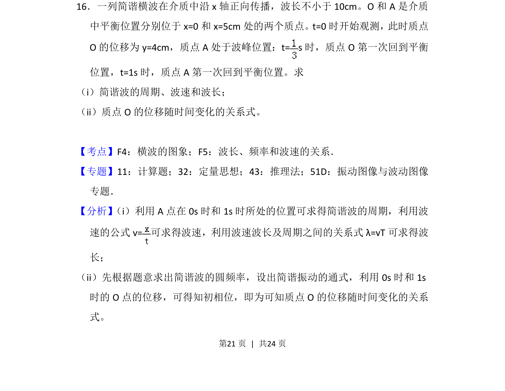
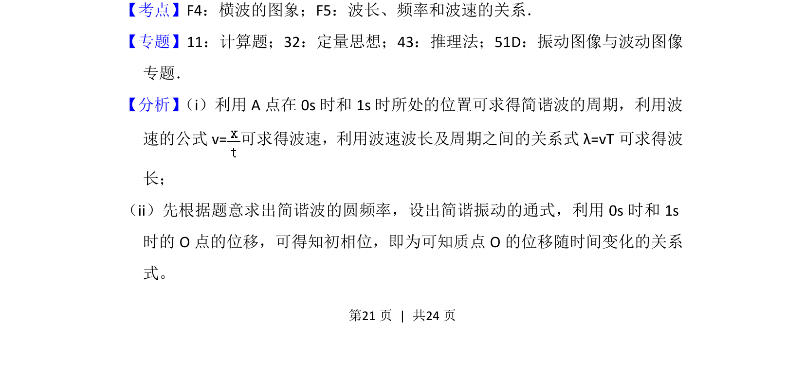
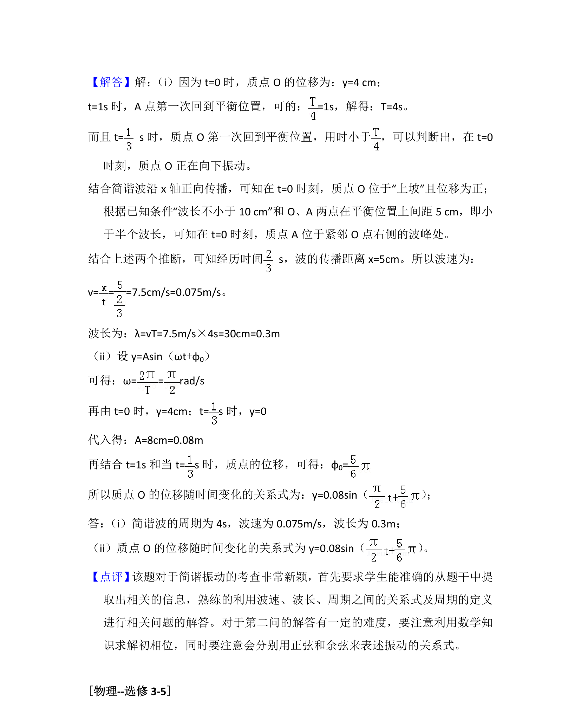

## 题面

## 摘要

考查简谐波的周期、波速、波长计算及质点位移随时间变化的三角函数关系式。

## 关联考点

- [[270-三角函数应用|三角函数]]
- [[261-周期|周期]]
- [[函数关系式]]
- [[图象分析]]

## 答案与解析

> 📄 原 PDF 第 21 页：`素材/真题/吉林/2008-2024·（吉林）物理高考真题/2016年高考物理试卷（新课标Ⅱ）（解析卷）.pdf`
