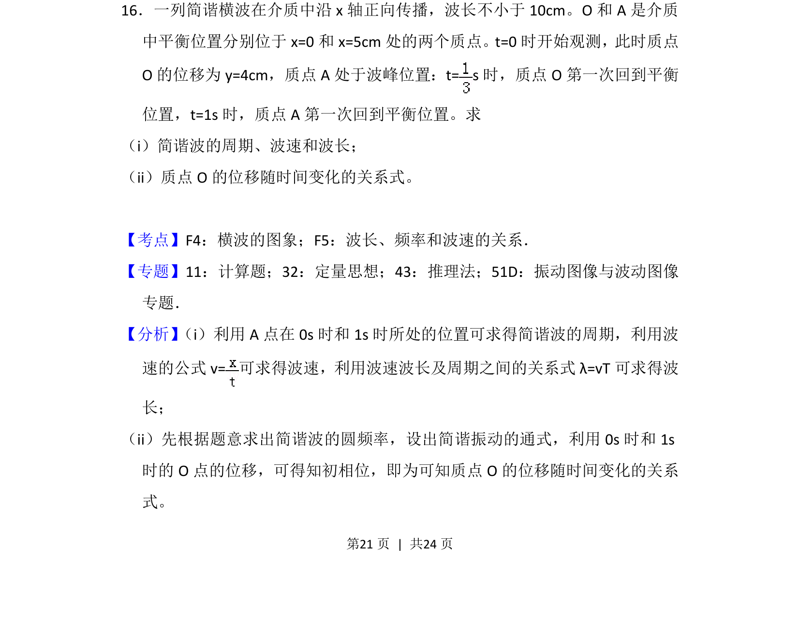
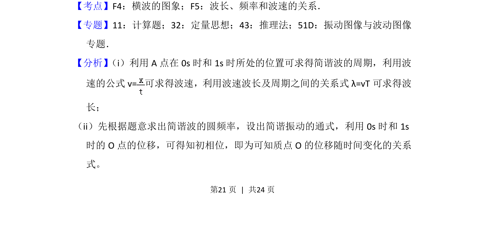
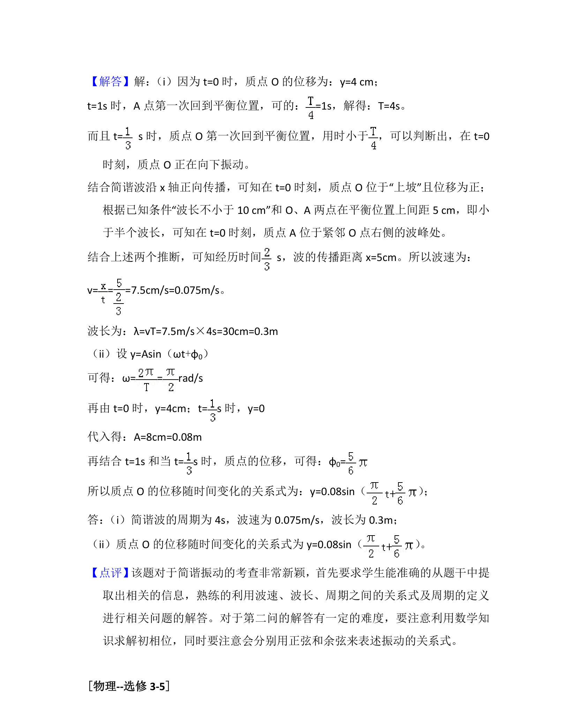

## 题面

## 摘要

已知波传播中两质点的位置和时间，求周期、波速、波长及质点振动方程。

## 关联考点

- [[630-横波的图象|横波的图象]]
- [[648-波长频率和波速的关系|波长频率和波速的关系]]
- [[715-简谐运动的表达式|简谐运动的表达式]]

## 答案与解析

> 📄 原 PDF 第 21 页：`素材/真题/吉林/2008-2024·（吉林）物理高考真题/2016年高考物理试卷（新课标Ⅱ）（解析卷）.pdf`

<!-- 题干文本-start -->
## 题干文本
16．一列简谐横波在介质中沿x轴正向传播，波长不小于10cm。O和A是介质
中平衡位置分别位于x=0和x=5cm处的两个质点。t=0时开始观测，此时质点
O的位移为y=4cm，质点A处于波峰位置：t= s时，质点O第一次回到平衡
位置，t=1s时，质点A第一次回到平衡位置。求
（i）简谐波的周期、波速和波长；
（ii）质点O的位移随时间变化的关系式。
<!-- 题干文本-end -->

<!-- 解析文本-start -->
## 解析文本
【考点】F4：横波的图象；F5：波长、频率和波速的关系．菁优网版权所有
【专题】11：计算题；32：定量思想；43：推理法；51D：振动图像与波动图像
专题．
【分析】 （i）利用A点在0s时和1s时所处的位置可求得简谐波的周期，利用波
速的公式v=可求得波速，利用波速波长及周期之间的关系式λ=vT可求得波
长；
（ii）先根据题意求出简谐波的圆频率，设出简谐振动的通式，利用0s时和1s
时的O点的位移，可得知初相位，即为可知质点O的位移随时间变化的关系
式。
<!-- 解析文本-end -->
