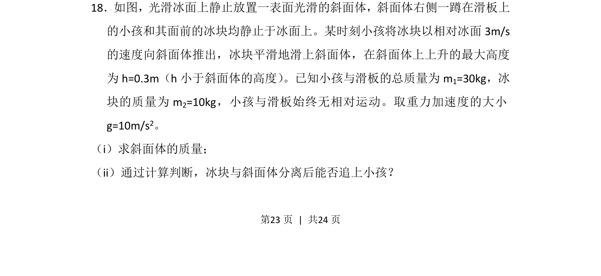
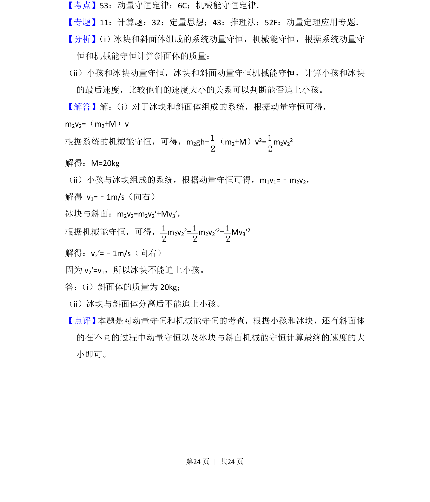

## 题面

## 摘要

动量守恒与机械能守恒综合应用，涉及斜面体质量计算及追及判断。

## 关联考点

- [[347-动量守恒定律|动量守恒定律]]
- [[085-机械能守恒-初中|机械能守恒定律]]
- [[507-临界条件分析|临界条件分析]]

## 答案与解析

> 📄 原 PDF 第 23 页：`素材/真题/吉林/2008-2024·（吉林）物理高考真题/2016年高考物理试卷（新课标Ⅱ）（解析卷）.pdf`
