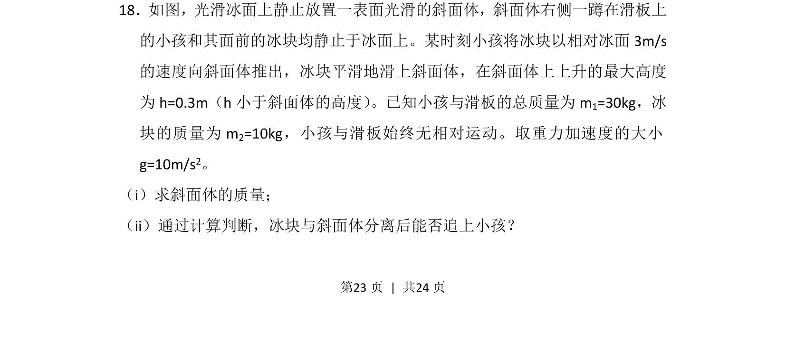
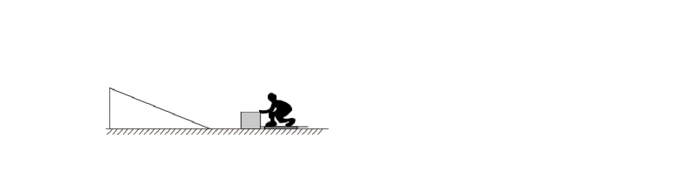
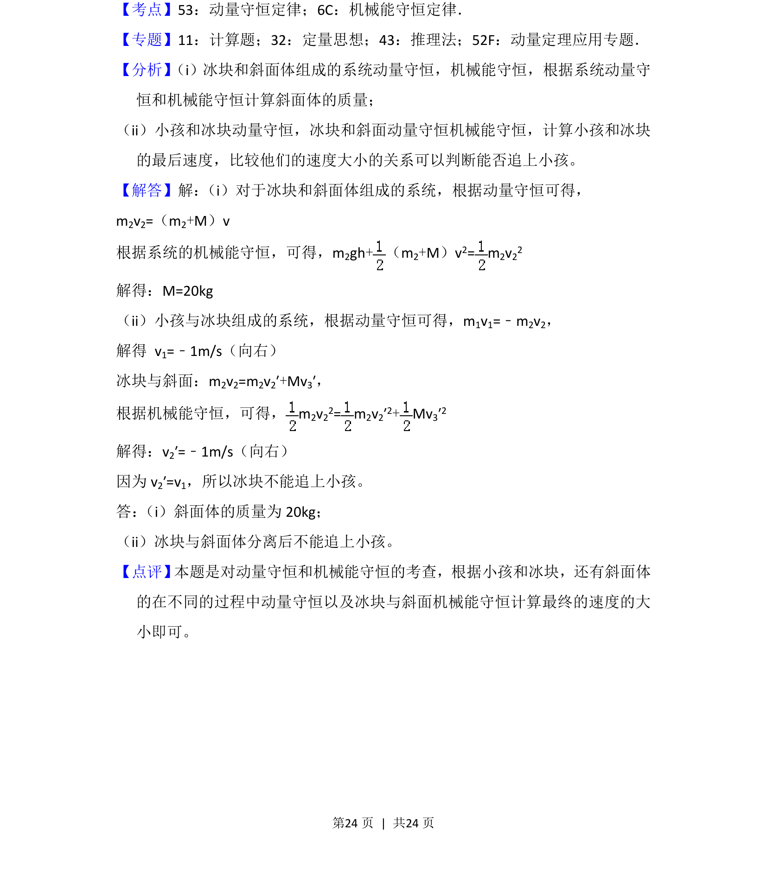

## 题面

## 摘要

动量守恒与机械能守恒综合应用，涉及斜面体质量计算及追及判断。

## 关联考点

- [[347-动量守恒定律|动量守恒定律]]
- [[085-机械能守恒-初中|机械能守恒定律]]
- [[507-临界条件分析|临界条件分析]]

## 答案与解析

> 📄 原 PDF 第 23 页：`素材/真题/吉林/2008-2024·（吉林）物理高考真题/2016年高考物理试卷（新课标Ⅱ）（解析卷）.pdf`

<!-- 题干文本-start -->
## 题干文本
18．如图，光滑冰面上静止放置一表面光滑的斜面体，斜面体右侧一蹲在滑板上
的小孩和其面前的冰块均静止于冰面上。某时刻小孩将冰块以相对冰面3m/s
的速度向斜面体推出，冰块平滑地滑上斜面体，在斜面体上上升的最大高度
为h=0.3m（h小于斜面体的高度） 。已知小孩与滑板的总质量为m1=30kg，冰
块的质量为m 2=10kg，小孩与滑板始终无相对运动。取重力加速度的大小
g=10m/s2。
（i）求斜面体的质量；
（ii）通过计算判断，冰块与斜面体分离后能否追上小孩？
<!-- 题干文本-end -->

<!-- 解析文本-start -->
## 解析文本

<!-- 解析文本-end -->
