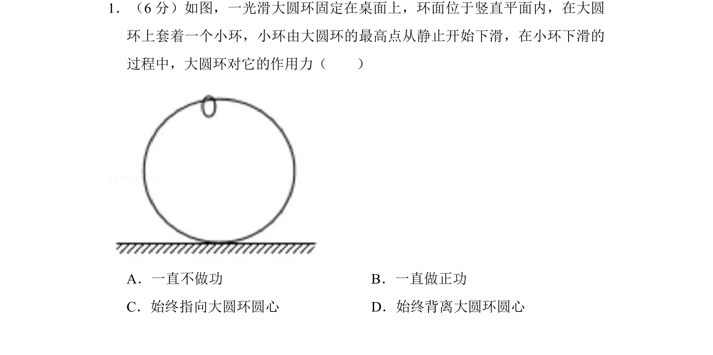
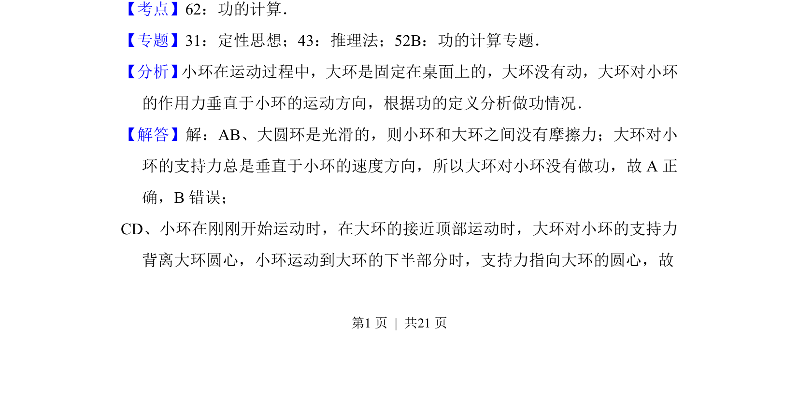
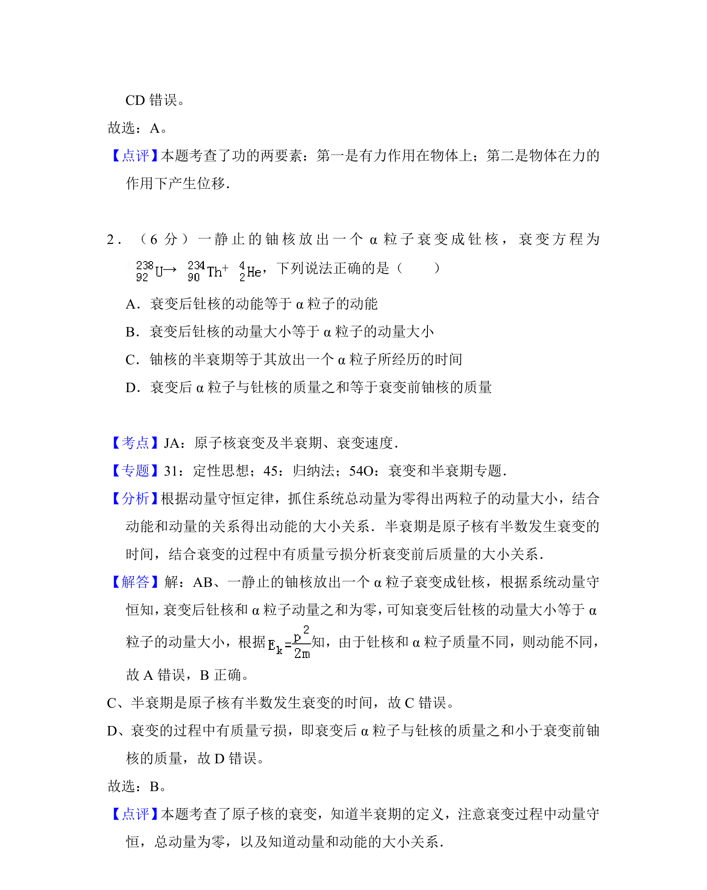

## 题面

## 摘要

小环在大圆环上下滑过程中，大环对其作用力的做功情况及方向判断

## 关联考点

- [[754-功的计算|功的计算]]
- [[256-向心力|向心力]]
- [[460-受力分析|受力分析]]

## 答案与解析

> 📄 原 PDF 第 1 页：`素材/真题/吉林/2008-2024·（吉林）物理高考真题/2017年高考物理试卷（新课标Ⅱ）（解析卷）.pdf`

<!-- 题干文本-start -->
## 题干文本
1．（6分）如图，一光滑大圆环固定在桌面上，环面位于竖直平面内，在大圆
环上套着一个小环，小环由大圆环的最高点从静止开始下滑，在小环下滑的
过程中，大圆环对它的作用力（　　）
A．一直不做功B．一直做正功
C．始终指向大圆环圆心D．始终背离大圆环圆心
<!-- 题干文本-end -->

<!-- 解析文本-start -->
## 解析文本
【考点】62：功的计算．菁优网版权所有
【专题】31：定性思想；43：推理法；52B：功的计算专题．
【分析】 小环在运动过程中，大环是固定在桌面上的，大环没有动，大环对小环
的作用力垂直于小环的运动方向，根据功的定义分析做功情况．
【解答】解：AB、大圆环是光滑的，则小环和大环之间没有摩擦力；大环对小
环的支持力总是垂直于小环的速度方向，所以大环对小环没有做功，故A正
确，B错误；
CD、小环在刚刚开始运动时，在大环的接近顶部运动时，大环对小环的支持力
背离大环圆心，小环运动到大环的下半部分时，支持力指向大环的圆心，故
<!-- 解析文本-end -->
