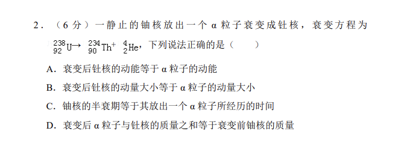
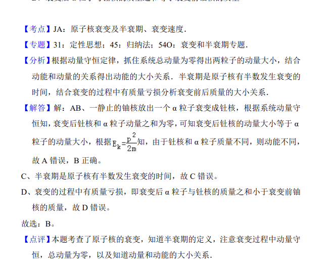

## 题面

## 摘要

一静止铀核放出α粒子衰变成钍核，由衰变方程判断动能/动量/半衰期/质量亏损的正误。

## 关联考点

- [[α衰变]]
- [[核反应方程]]
- [[347-动量守恒定律|动量守恒定律]]
- [[424-半衰期|半衰期]]
- [[449-质能方程|质量亏损]]

## 答案与解析

> 📄 原 PDF 第 1 页：`素材/真题/吉林/2008-2024·（吉林）物理高考真题/2017年高考物理试卷（新课标Ⅱ）（解析卷）.pdf`
