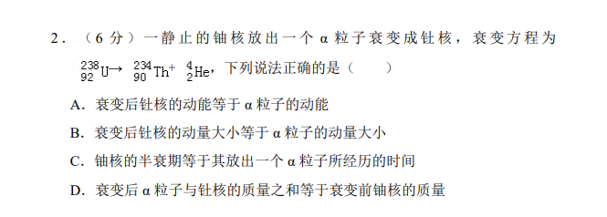
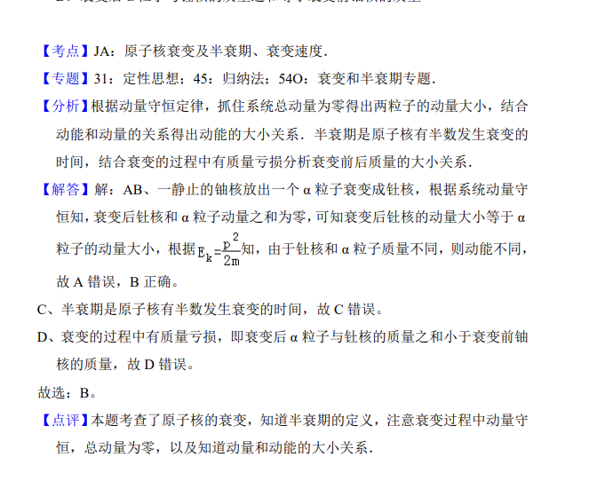

## 题面

## 摘要

一静止铀核放出α粒子衰变成钍核，由衰变方程判断动能/动量/半衰期/质量亏损的正误。

## 关联考点

- [[499-α衰变|α衰变]]
- [[629-核反应方程|核反应方程]]
- [[347-动量守恒定律|动量守恒定律]]
- [[424-半衰期|半衰期]]
- [[449-质能方程|质量亏损]]

## 答案与解析

> 📄 原 PDF 第 1 页：`素材/真题/吉林/2008-2024·（吉林）物理高考真题/2017年高考物理试卷（新课标Ⅱ）（解析卷）.pdf`

<!-- 题干文本-start -->
## 题干文本

<!-- 题干文本-end -->

<!-- 解析文本-start -->
## 解析文本
第1页 | 共21页  
2017年全国统一高考物理试卷（新课标Ⅱ）
参考答案与试题解析
　
一、选择题：本大题共8小题，每小题6分．在每小题给出的四个选项中，第
1～5题只有一项是符合题目要求，第6～8题有多项符合题目要求．全部选
对的得6分，选对但不全的得3分．有选错的得0分．
1．（6分）如图，一光滑大圆环固定在桌面上，环面位于竖直平面内，在大圆
环上套着一个小环，小环由大圆环的最高点从静止开始下滑，在小环下滑的
过程中，大圆环对它的作用力（　　）
A．一直不做功B．一直做正功
C．始终指向大圆环圆心D．始终背离大圆环圆心
【考点】62：功的计算．菁优网版权所有
【专题】31：定性思想；43：推理法；52B：功的计算专题．
【分析】 小环在运动过程中，大环是固定在桌面上的，大环没有动，大环对小环
的作用力垂直于小环的运动方向，根据功的定义分析做功情况．
【解答】解：AB、大圆环是光滑的，则小环和大环之间没有摩擦力；大环对小
环的支持力总是垂直于小环的速度方向，所以大环对小环没有做功，故A正
确，B错误；
CD、小环在刚刚开始运动时，在大环的接近顶部运动时，大环对小环的支持力
背离大环圆心，小环运动到大环的下半部分时，支持力指向大环的圆心，故
<!-- 解析文本-end -->
