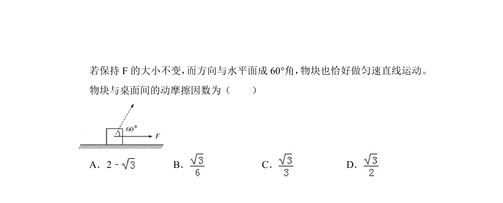
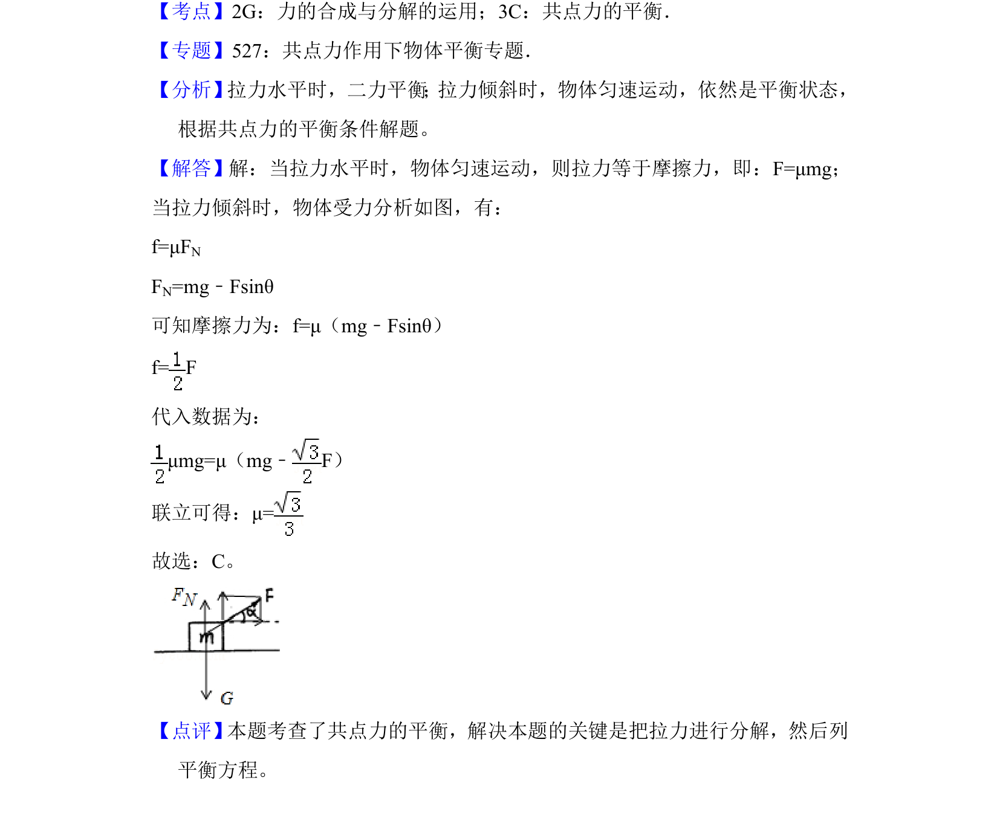

## 题面

## 摘要

水平拉力和60°斜向拉力大小相同时物块均匀速运动，利用受力平衡求动摩擦因数。

## 关联考点

- [[力学]]
- [[081-摩擦力|摩擦力]]
- [[牛顿定律]]
- [[力的平衡]]

## 答案与解析

> 📄 原 PDF 第 2 页：`素材/真题/吉林/2008-2024·（吉林）物理高考真题/2017年高考物理试卷（新课标Ⅱ）（解析卷）.pdf`
