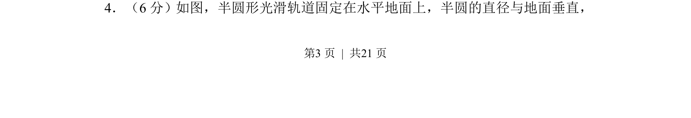
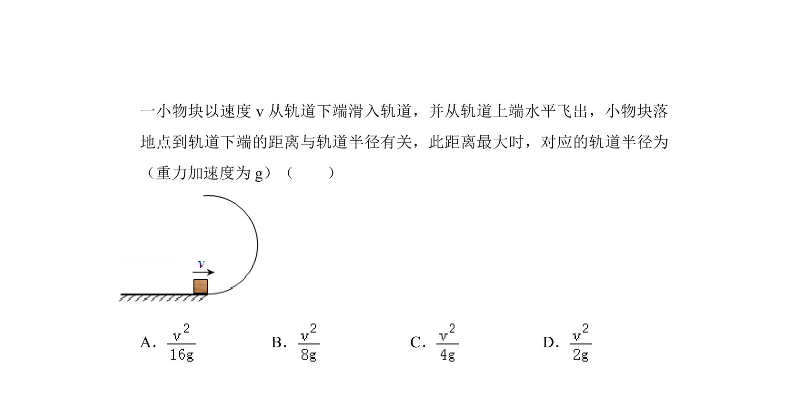
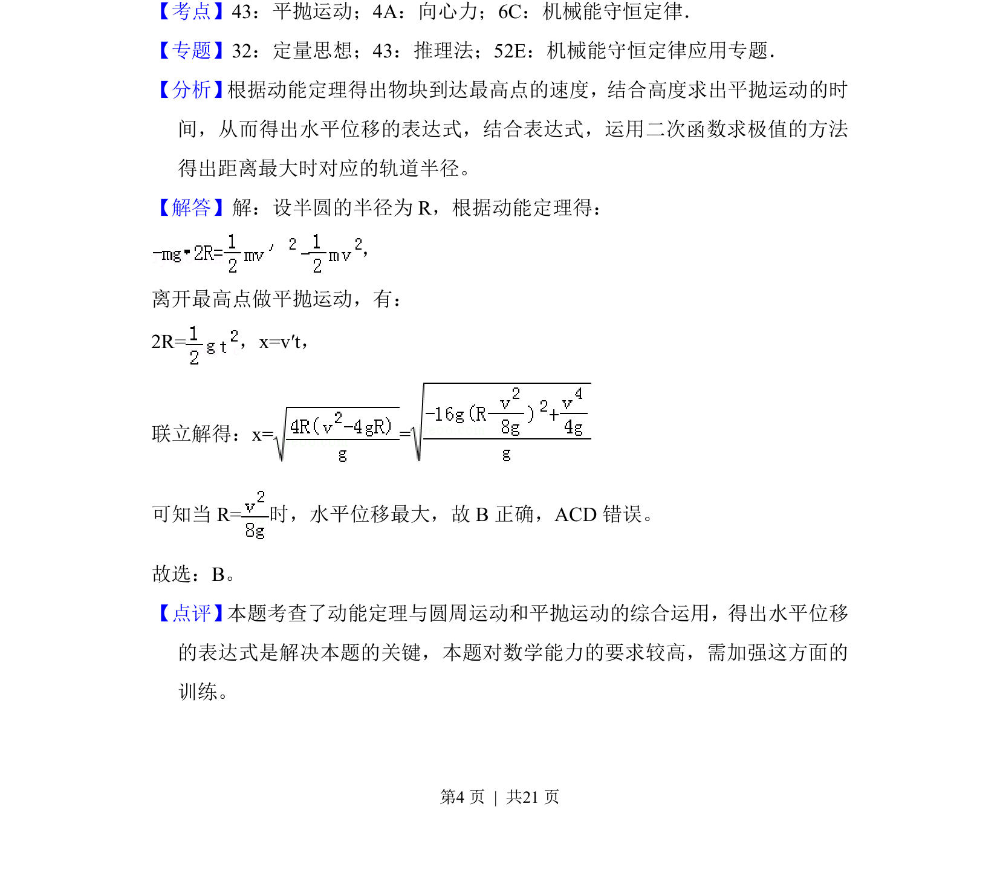

## 题面

## 摘要

物块沿半圆形竖直光滑轨道从底端滑入从顶端飞出，用能量守恒与平抛运动求落点距离最大时对应轨道半径。

## 关联考点

- [[530-力学|力学]]
- [[197-能量守恒定律|能量守恒]]
- [[261-平抛运动|平抛运动]]
- [[258-圆周运动|圆周运动]]

## 答案与解析

> 📄 原 PDF 第 3 页：`素材/真题/吉林/2008-2024·（吉林）物理高考真题/2017年高考物理试卷（新课标Ⅱ）（解析卷）.pdf`
