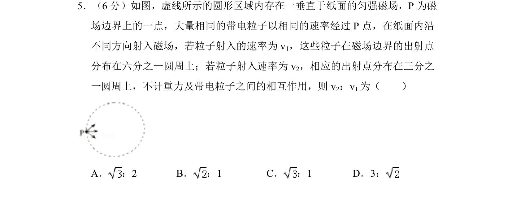
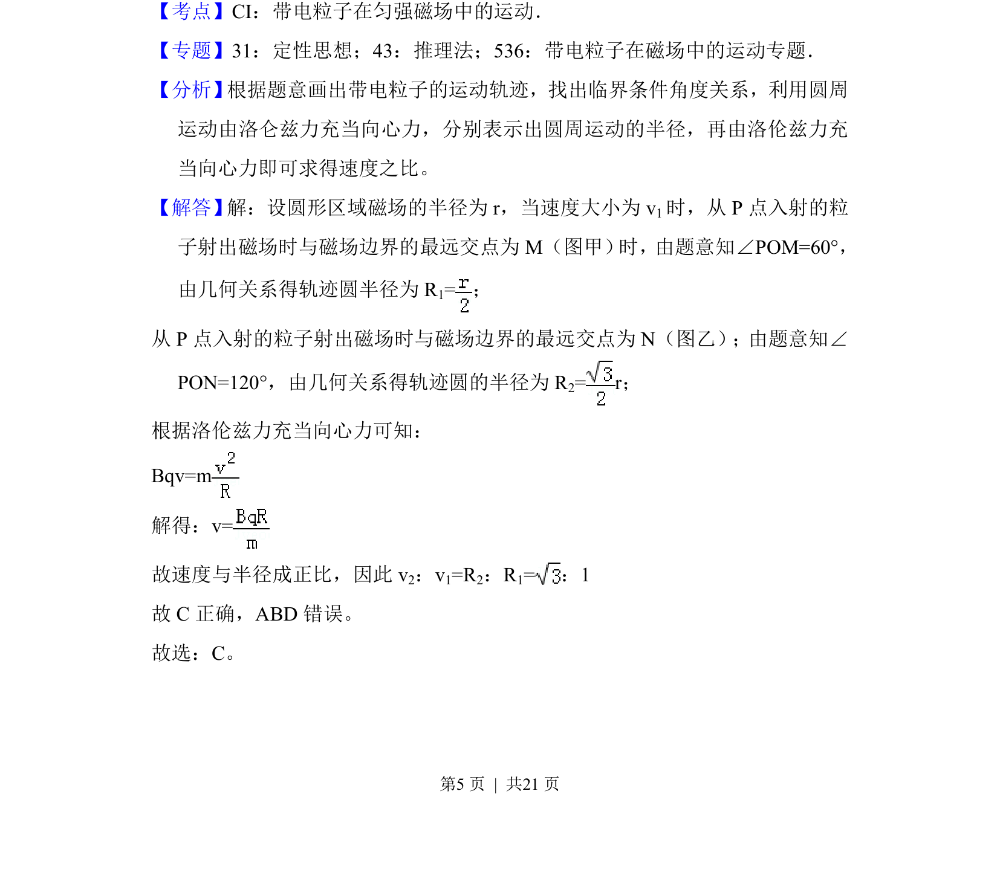
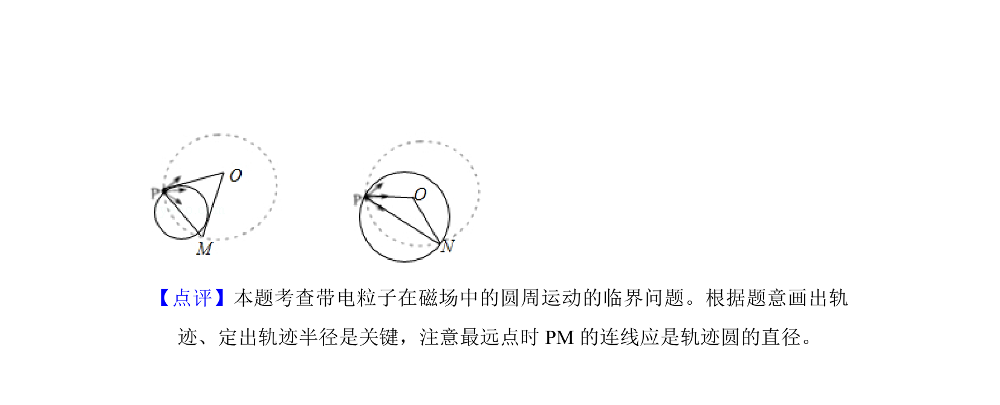

## 题面

## 摘要

带电粒子以不同速率经圆形匀强磁场区域边界P点射入，出射点分别分布在1/6和1/3圆周上，求两速率之比。

## 关联考点

- [[187-磁场|磁场]]
- [[593-带电粒子|带电粒子]]
- [[253-匀速圆周运动|匀速圆周运动]]
- [[304-洛伦兹力|洛伦兹力]]

## 答案与解析

> 📄 原 PDF 第 5 页：`素材/真题/吉林/2008-2024·（吉林）物理高考真题/2017年高考物理试卷（新课标Ⅱ）（解析卷）.pdf`
