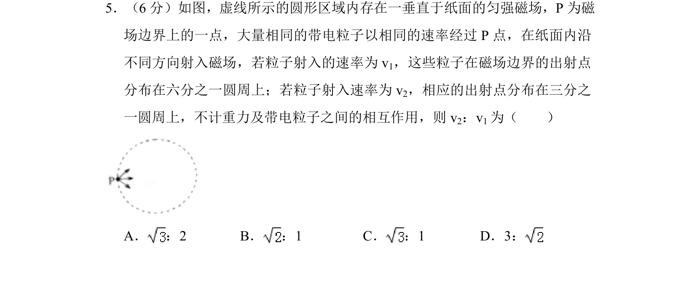
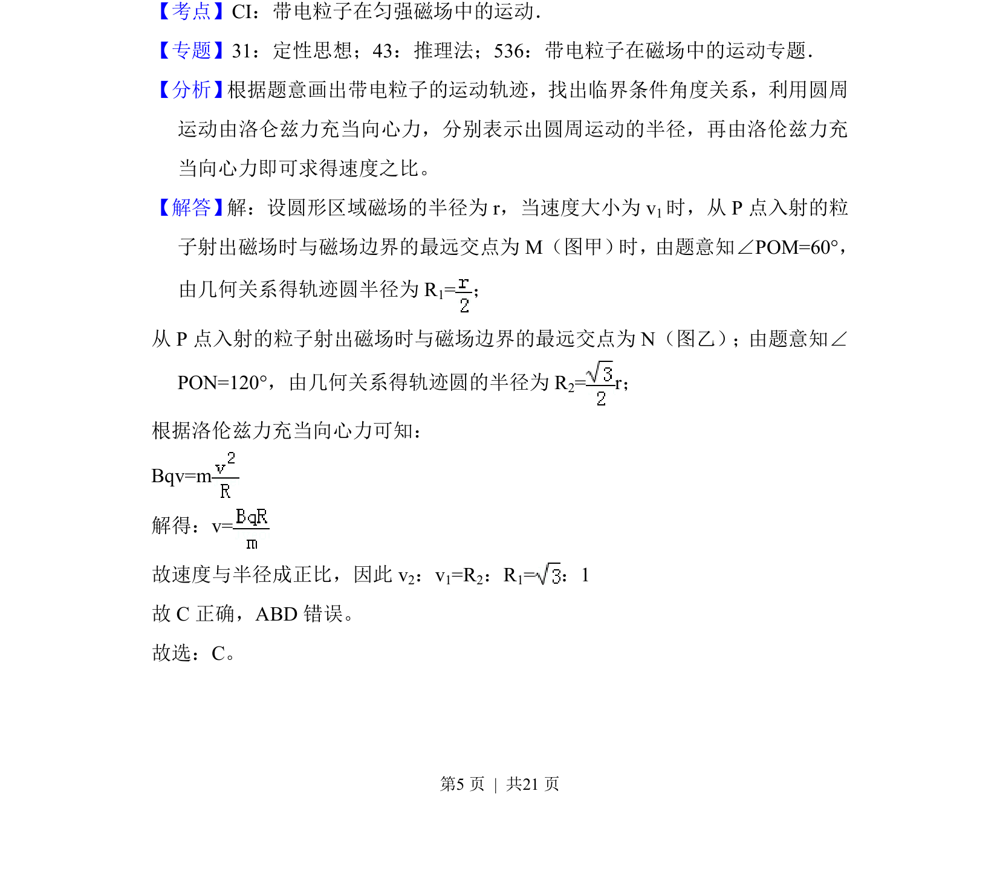
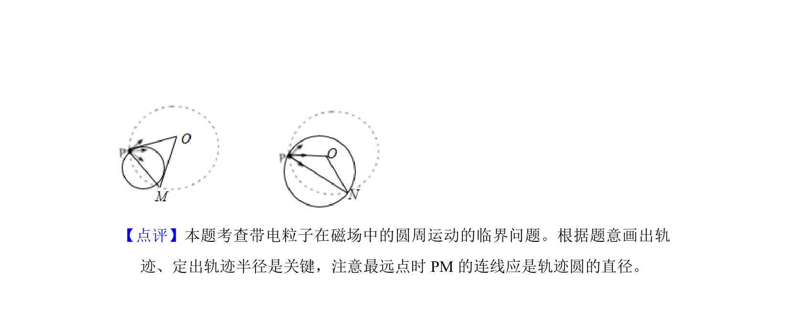

## 题面

## 摘要

带电粒子以不同速率经圆形匀强磁场区域边界P点射入，出射点分别分布在1/6和1/3圆周上，求两速率之比。

## 关联考点

- [[187-磁场|磁场]]
- [[593-带电粒子|带电粒子]]
- [[253-匀速圆周运动|匀速圆周运动]]
- [[304-洛伦兹力|洛伦兹力]]

## 答案与解析

> 📄 原 PDF 第 5 页：`素材/真题/吉林/2008-2024·（吉林）物理高考真题/2017年高考物理试卷（新课标Ⅱ）（解析卷）.pdf`

<!-- 题干文本-start -->
## 题干文本
5．（6分）如图，虚线所示的圆形区域内存在一垂直于纸面的匀强磁场，P为磁
场边界上的一点，大量相同的带电粒子以相同的速率经过P点，在纸面内沿
不同方向射入磁场，若粒子射入的速率为v 1，这些粒子在磁场边界的出射点
分布在六分之一圆周上；若粒子射入速率为v 2，相应的出射点分布在三分之
一圆周上，不计重力及带电粒子之间的相互作用，则v 2：v1为（　　）
A． ：2 B． ：1 C． ：1 D．3：
<!-- 题干文本-end -->

<!-- 解析文本-start -->
## 解析文本
【考点】CI：带电粒子在匀强磁场中的运动．菁优网版权所有
【专题】31：定性思想；43：推理法；536：带电粒子在磁场中的运动专题．
【分析】 根据题意画出带电粒子的运动轨迹，找出临界条件角度关系，利用圆周
运动由洛仑兹力充当向心力，分别表示出圆周运动的半径，再由洛伦兹力充
当向心力即可求得速度之比。
【解答】 解：设圆形区域磁场的半径为r，当速度大小为v1时，从P点入射的粒
子射出磁场时与磁场边界的最远交点为M（图甲） 时，由题意知∠POM=60°，
由几何关系得轨迹圆半径为R 1=；
从P点入射的粒子射出磁场时与磁场边界的最远交点为N（图乙）；由题意知∠
PON=120°，由几何关系得轨迹圆的半径为R 2= r；
根据洛伦兹力充当向心力可知：
Bqv=m
解得：v=
故速度与半径成正比，因此v 2：v1=R2：R1=：1
故C正确，ABD错误。
故选：C。
<!-- 解析文本-end -->
