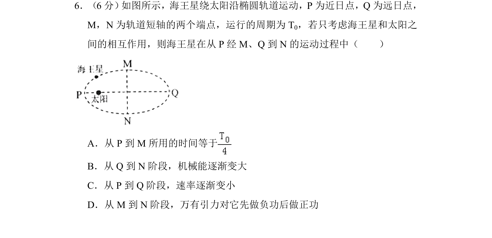
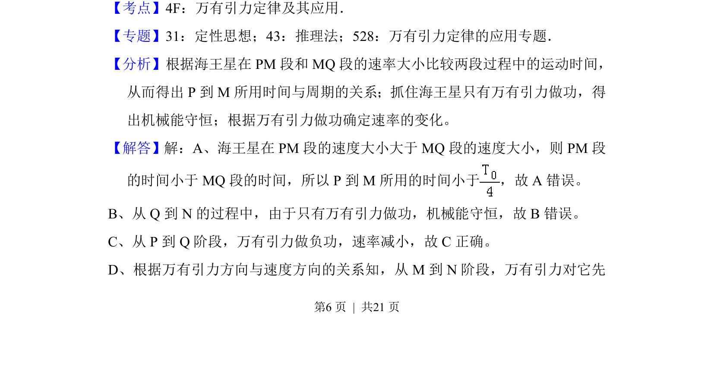
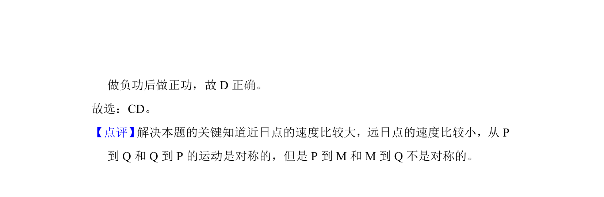

## 题面

## 摘要

海王星沿椭圆轨道绕太阳运动，考查从近日点经短轴端到远日点过程中的时间、速率、机械能和万有引力做功。

## 关联考点

- [[500-万有引力|万有引力]]
- [[605-开普勒定律|开普勒定律]]
- [[491-行星运动|行星运动]]
- [[084-机械能|机械能]]

## 答案与解析

> 📄 原 PDF 第 6 页：`素材/真题/吉林/2008-2024·（吉林）物理高考真题/2017年高考物理试卷（新课标Ⅱ）（解析卷）.pdf`
