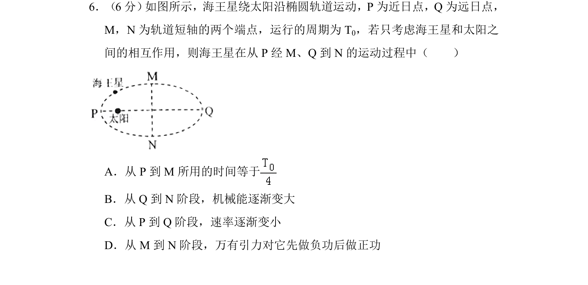
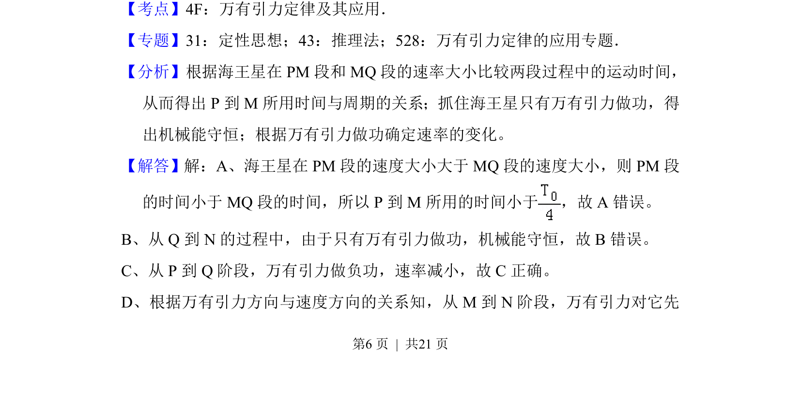
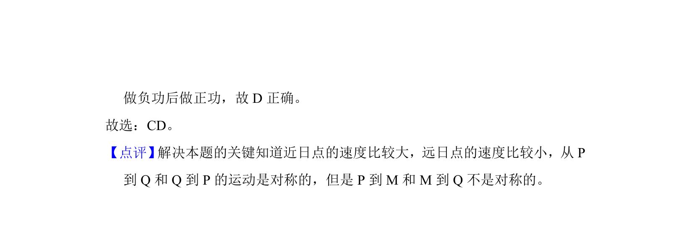

## 题面

## 摘要

海王星沿椭圆轨道绕太阳运动，考查从近日点经短轴端到远日点过程中的时间、速率、机械能和万有引力做功。

## 关联考点

- [[500-万有引力|万有引力]]
- [[605-开普勒定律|开普勒定律]]
- [[491-行星运动|行星运动]]
- [[084-机械能|机械能]]

## 答案与解析

> 📄 原 PDF 第 6 页：`素材/真题/吉林/2008-2024·（吉林）物理高考真题/2017年高考物理试卷（新课标Ⅱ）（解析卷）.pdf`

<!-- 题干文本-start -->
## 题干文本
6．（6分） 如图所示，海王星绕太阳沿椭圆轨道运动，P为近日点，Q为远日点，
M，N为轨道短轴的两个端点，运行的周期为T 0，若只考虑海王星和太阳之
间的相互作用，则海王星在从P经M、Q到N的运动过程中（　　）
A．从P到M所用的时间等于
B．从Q到N阶段，机械能逐渐变大
C．从P到Q阶段，速率逐渐变小
D．从M到N阶段，万有引力对它先做负功后做正功
<!-- 题干文本-end -->

<!-- 解析文本-start -->
## 解析文本
【考点】4F：万有引力定律及其应用．菁优网版权所有
【专题】31：定性思想；43：推理法；528：万有引力定律的应用专题．
【分析】根据海王星在PM段和MQ段的速率大小比较两段过程中的运动时间，
从而得出P到M所用时间与周期的关系；抓住海王星只有万有引力做功，得
出机械能守恒；根据万有引力做功确定速率的变化。
【解答】解：A、海王星在PM段的速度大小大于MQ段的速度大小，则PM段
的时间小于MQ段的时间，所以P到M所用的时间小于 ，故A错误。
B、从Q到N的过程中，由于只有万有引力做功，机械能守恒，故B错误。
C、从P到Q阶段，万有引力做负功，速率减小，故C正确。
D、根据万有引力方向与速度方向的关系知，从M到N阶段，万有引力对它先
<!-- 解析文本-end -->
