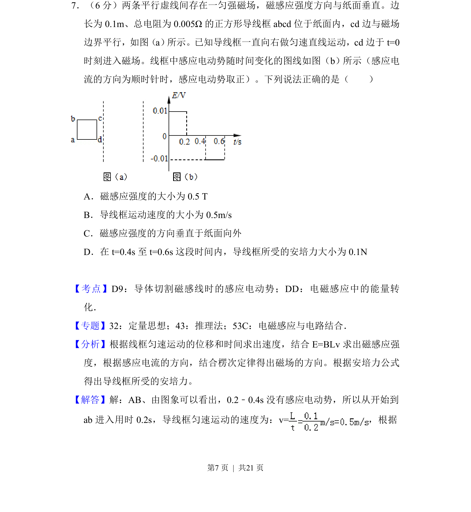
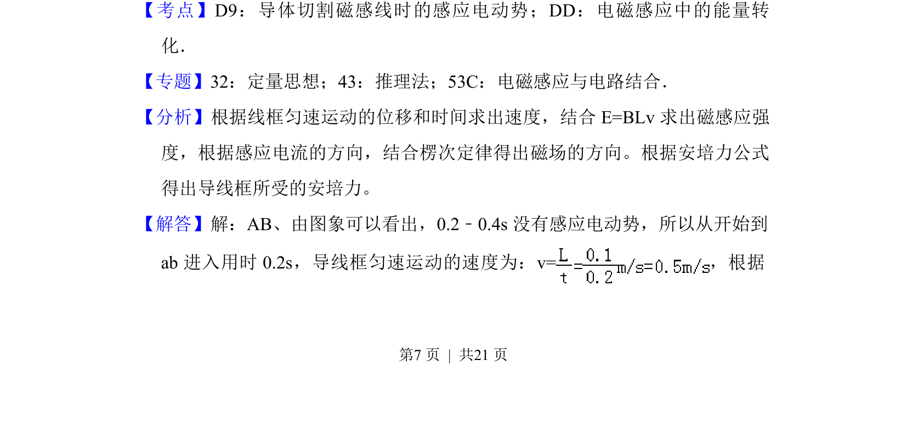
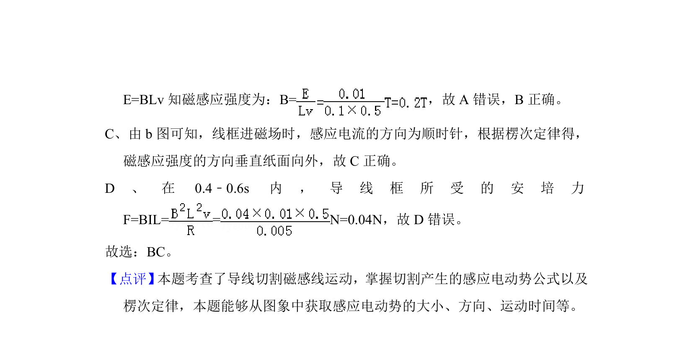

## 题面

## 摘要

矩形线框在匀强磁场中匀速运动，给定EMF-时间图像，判断磁场方向、导线速度及安培力大小。

## 关联考点

- [[175-电磁感应|电磁感应]]
- [[法拉第定律]]
- [[188-磁场对通电导体的作用|安培力]]
- [[187-磁场|磁场]]

## 答案与解析

> 📄 原 PDF 第 7 页：`素材/真题/吉林/2008-2024·（吉林）物理高考真题/2017年高考物理试卷（新课标Ⅱ）（解析卷）.pdf`
