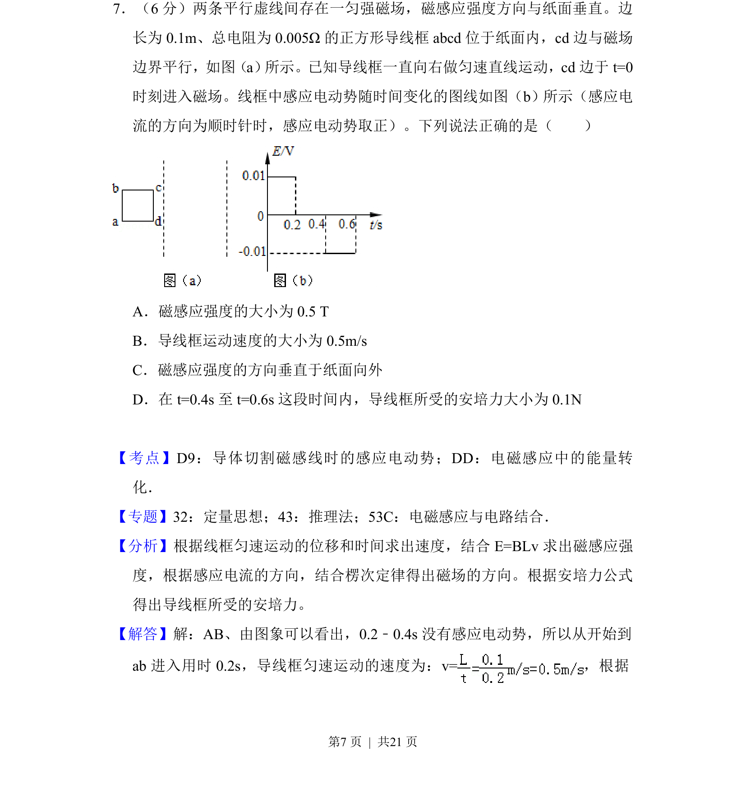
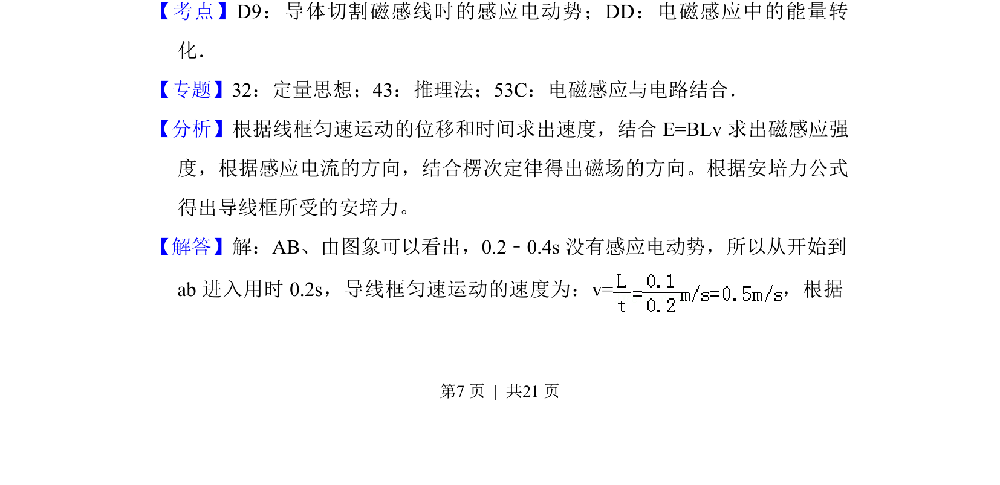
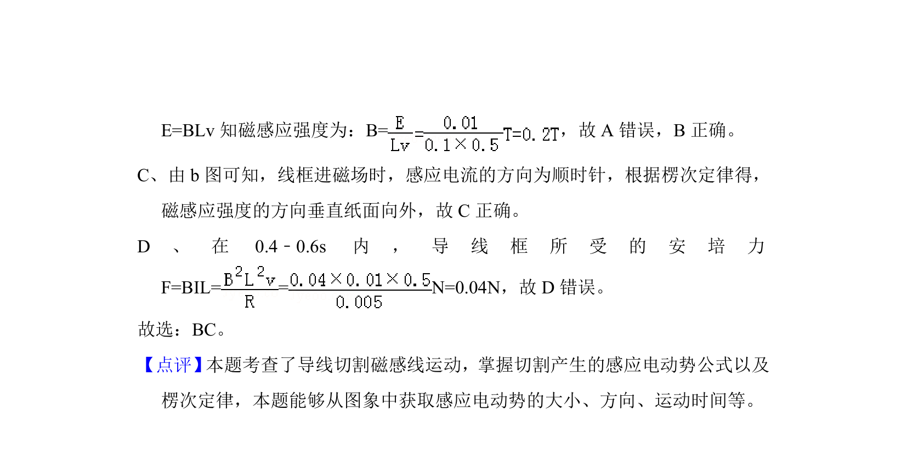

## 题面

## 摘要

矩形线框在匀强磁场中匀速运动，给定EMF-时间图像，判断磁场方向、导线速度及安培力大小。

## 关联考点

- [[175-电磁感应|电磁感应]]
- [[642-法拉第定律|法拉第定律]]
- [[188-磁场对通电导体的作用|安培力]]
- [[187-磁场|磁场]]

## 答案与解析

> 📄 原 PDF 第 7 页：`素材/真题/吉林/2008-2024·（吉林）物理高考真题/2017年高考物理试卷（新课标Ⅱ）（解析卷）.pdf`

<!-- 题干文本-start -->
## 题干文本
7．（6分）两条平行虚线间存在一匀强磁场，磁感应强度方向与纸面垂直。边
长为0.1m、总电阻为0.005Ω的正方形导线框abcd位于纸面内，cd边与磁场
边界平行，如图（a） 所示。已知导线框一直向右做匀速直线运动，cd边于t=0
时刻进入磁场。线框中感应电动势随时间变化的图线如图（b）所示（感应电
流的方向为顺时针时，感应电动势取正）。下列说法正确的是（　　）
A．磁感应强度的大小为0.5 T
B．导线框运动速度的大小为0.5m/s
C．磁感应强度的方向垂直于纸面向外
D．在t=0.4s至t=0.6s这段时间内，导线框所受的安培力大小为0.1N
<!-- 题干文本-end -->

<!-- 解析文本-start -->
## 解析文本
【考点】D9：导体切割磁感线时的感应电动势；DD：电磁感应中的能量转
化．菁优网版权所有
【专题】32：定量思想；43：推理法；53C：电磁感应与电路结合．
【分析】根据线框匀速运动的位移和时间求出速度，结合E=BLv求出磁感应强
度，根据感应电流的方向，结合楞次定律得出磁场的方向。根据安培力公式
得出导线框所受的安培力。
【解答】解：AB、由图象可以看出，0.2﹣0.4s没有感应电动势，所以从开始到
ab进入用时0.2s，导线框匀速运动的速度为：v=，根据
<!-- 解析文本-end -->
