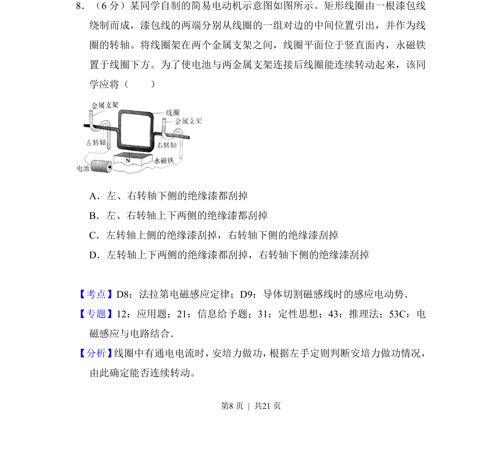
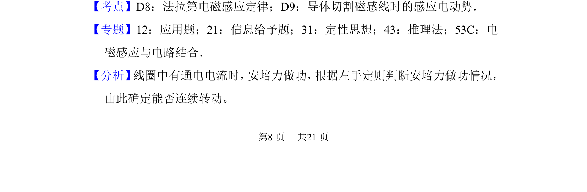
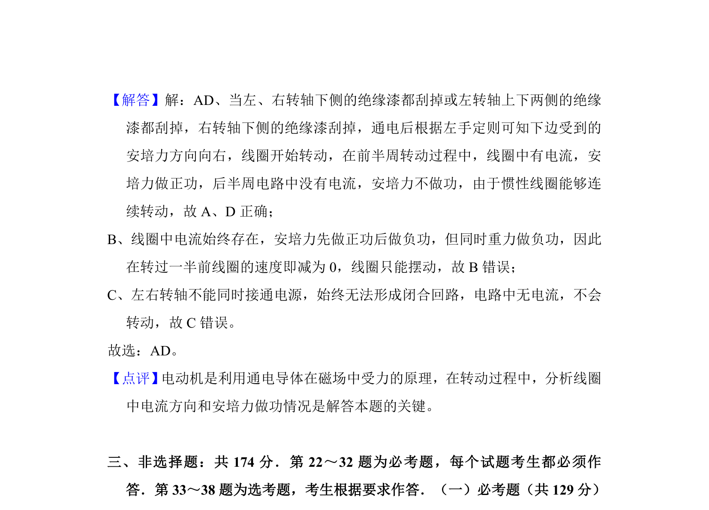

## 题面

## 摘要

简易电动机线圈两轴绝缘漆刮除方案，判断哪侧需刮去绝缘漆才能使线圈持续旋转。

## 关联考点

- [[161-电动机|电动机]]
- [[175-电磁感应|电磁感应]]
- [[188-磁场对通电导体的作用|安培力]]
- [[187-磁场|磁场]]

## 答案与解析

> 📄 原 PDF 第 8 页：`素材/真题/吉林/2008-2024·（吉林）物理高考真题/2017年高考物理试卷（新课标Ⅱ）（解析卷）.pdf`
