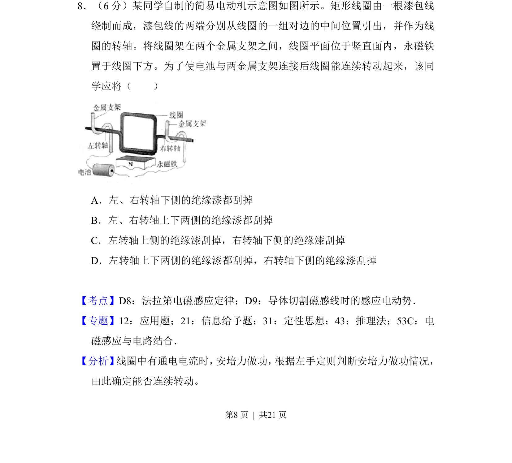
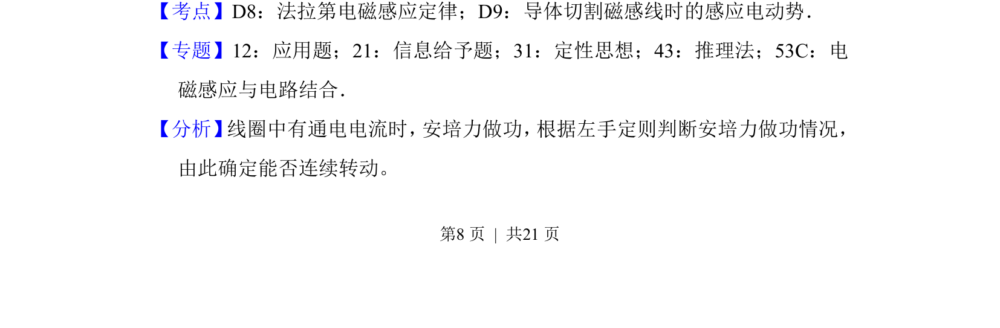
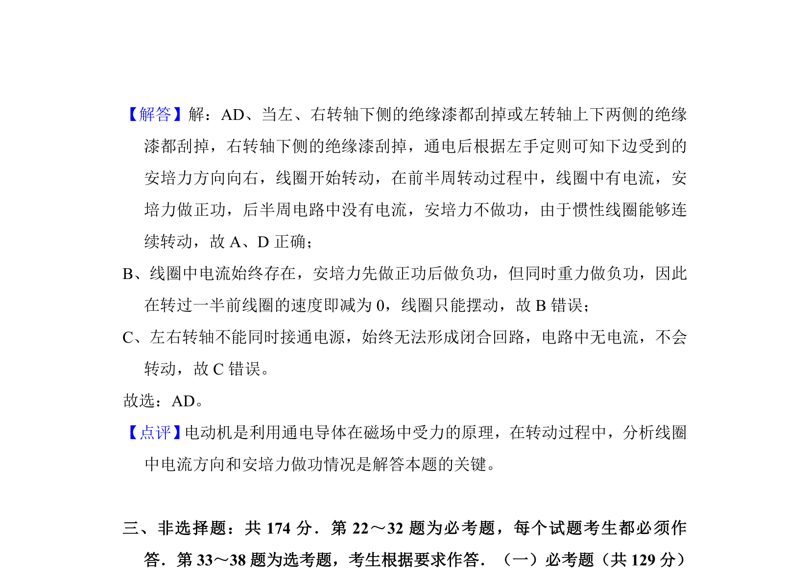

## 题面

## 摘要

简易电动机线圈两轴绝缘漆刮除方案，判断哪侧需刮去绝缘漆才能使线圈持续旋转。

## 关联考点

- [[161-电动机|电动机]]
- [[175-电磁感应|电磁感应]]
- [[188-磁场对通电导体的作用|安培力]]
- [[187-磁场|磁场]]

## 答案与解析

> 📄 原 PDF 第 8 页：`素材/真题/吉林/2008-2024·（吉林）物理高考真题/2017年高考物理试卷（新课标Ⅱ）（解析卷）.pdf`

<!-- 题干文本-start -->
## 题干文本
8．（6分）某同学自制的简易电动机示意图如图所示。矩形线圈由一根漆包线
绕制而成，漆包线的两端分别从线圈的一组对边的中间位置引出，并作为线
圈的转轴。将线圈架在两个金属支架之间，线圈平面位于竖直面内，永磁铁
置于线圈下方。为了使电池与两金属支架连接后线圈能连续转动起来，该同
学应将（　　）
A．左、右转轴下侧的绝缘漆都刮掉
B．左、右转轴上下两侧的绝缘漆都刮掉
C．左转轴上侧的绝缘漆刮掉，右转轴下侧的绝缘漆刮掉
D．左转轴上下两侧的绝缘漆都刮掉，右转轴下侧的绝缘漆刮掉
<!-- 题干文本-end -->

<!-- 解析文本-start -->
## 解析文本
【考点】D8：法拉第电磁感应定律；D9：导体切割磁感线时的感应电动势．菁优网版权所有
【专题】12：应用题；21：信息给予题；31：定性思想；43：推理法；53C：电
磁感应与电路结合．
【分析】 线圈中有通电电流时， 安培力做功， 根据左手定则判断安培力做功情况，
由此确定能否连续转动。
<!-- 解析文本-end -->
