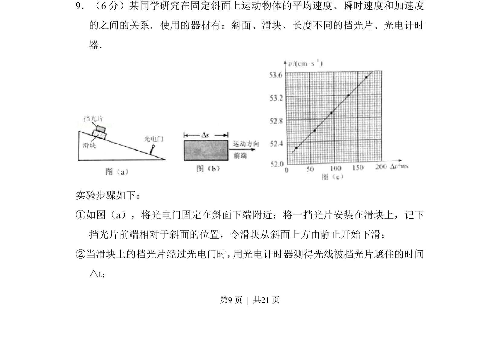
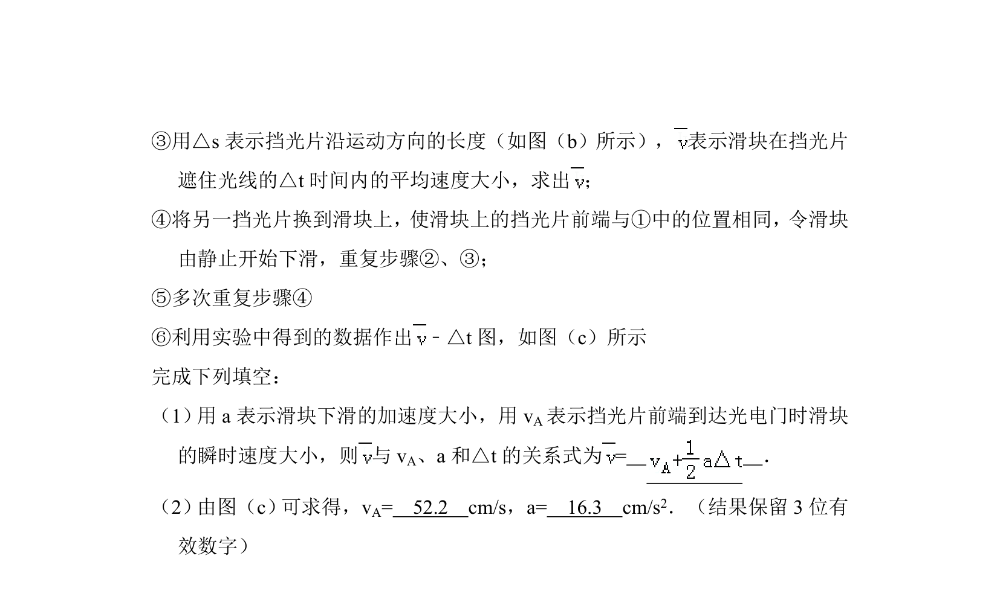
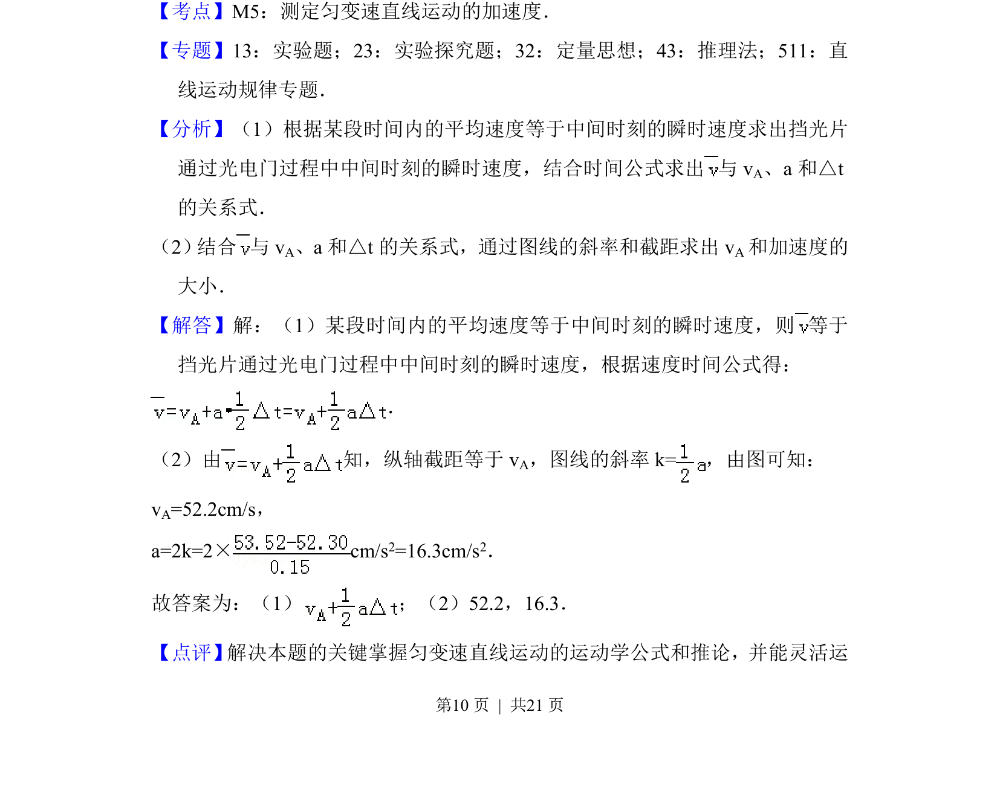
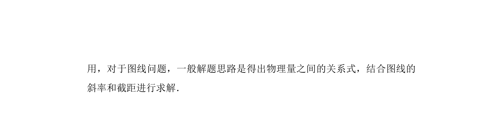

## 题面

## 摘要

斜面上用挡光片和光电门测不同时间内平均速度，利用v̄-Δt图线斜率和截距求瞬时速度和加速度。

## 关联考点

- [[732-运动学|运动学]]
- [[215-匀变速直线运动|匀变速直线运动]]
- [[585-实验题|实验题]]
- [[023-平均速度|平均速度]]

## 答案与解析

> 📄 原 PDF 第 9 页：`素材/真题/吉林/2008-2024·（吉林）物理高考真题/2017年高考物理试卷（新课标Ⅱ）（解析卷）.pdf`
