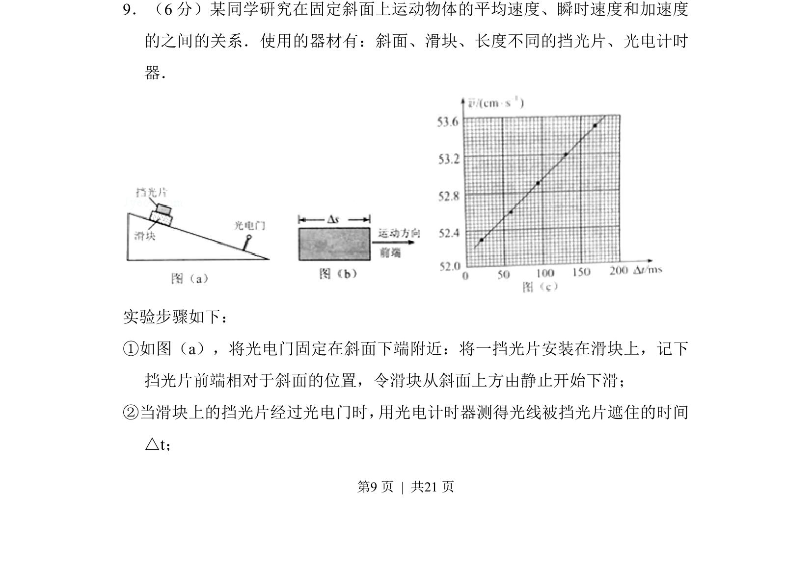
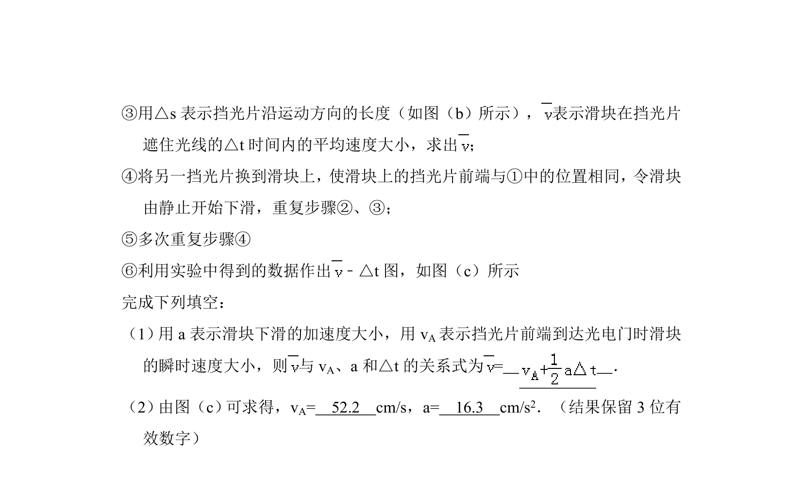
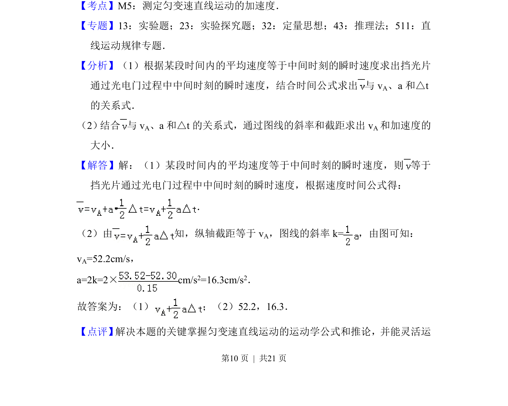
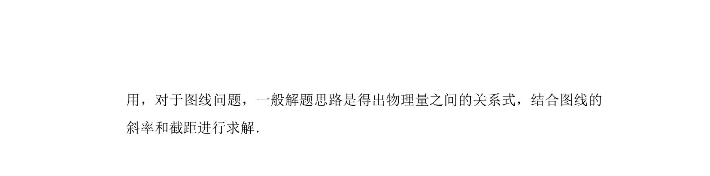

## 题面

## 摘要

斜面上用挡光片和光电门测不同时间内平均速度，利用v̄-Δt图线斜率和截距求瞬时速度和加速度。

## 关联考点

- [[732-运动学|运动学]]
- [[215-匀变速直线运动|匀变速直线运动]]
- [[585-实验题|实验题]]
- [[023-平均速度|平均速度]]

## 答案与解析

> 📄 原 PDF 第 9 页：`素材/真题/吉林/2008-2024·（吉林）物理高考真题/2017年高考物理试卷（新课标Ⅱ）（解析卷）.pdf`

<!-- 题干文本-start -->
## 题干文本
9．（6分）某同学研究在固定斜面上运动物体的平均速度、瞬时速度和加速度
的之间的关系．使用的器材有：斜面、滑块、长度不同的挡光片、光电计时
器．
实验步骤如下：
①如图（a），将光电门固定在斜面下端附近：将一挡光片安装在滑块上，记下
挡光片前端相对于斜面的位置，令滑块从斜面上方由静止开始下滑；
②当滑块上的挡光片经过光电门时， 用光电计时器测得光线被挡光片遮住的时间
△t；
<!-- 题干文本-end -->

<!-- 解析文本-start -->
## 解析文本

<!-- 解析文本-end -->
