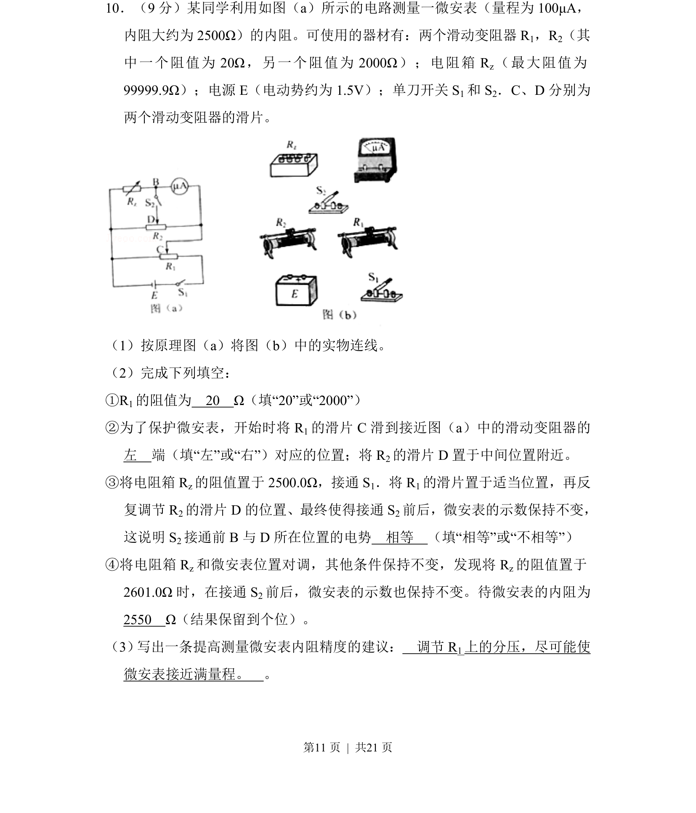
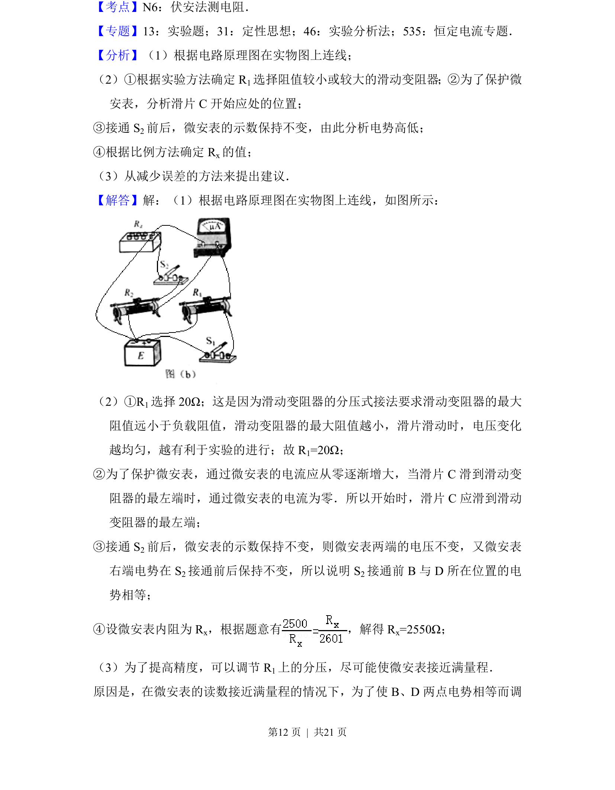
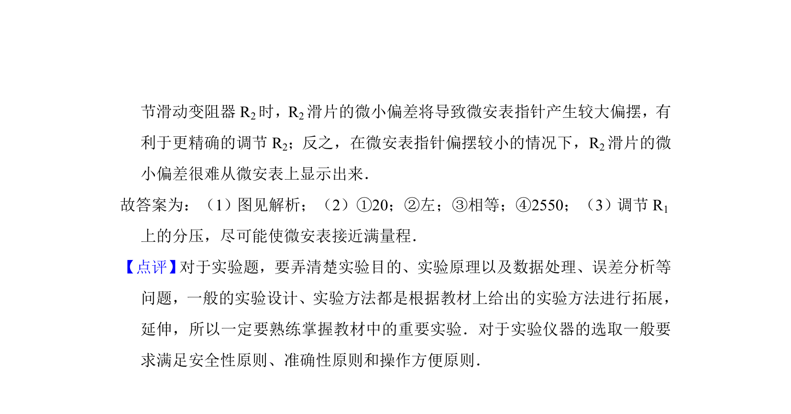

## 题面

## 摘要

设计并连接用微安表和滑动变阻器测电源电动势及内阻的电路，完成填空并分析测量精度。

## 关联考点

- [[695-电路实验|电路实验]]
- [[307-电动势|电动势]]
- [[291-内阻|内阻]]
- [[141-欧姆定律-初中|欧姆定律]]

## 答案与解析

> 📄 原 PDF 第 11 页：`素材/真题/吉林/2008-2024·（吉林）物理高考真题/2017年高考物理试卷（新课标Ⅱ）（解析卷）.pdf`
