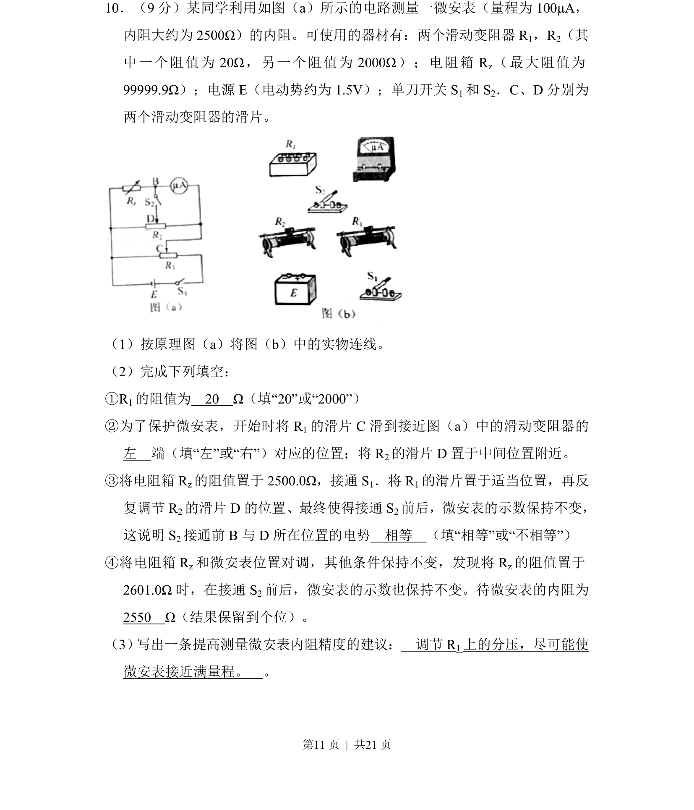
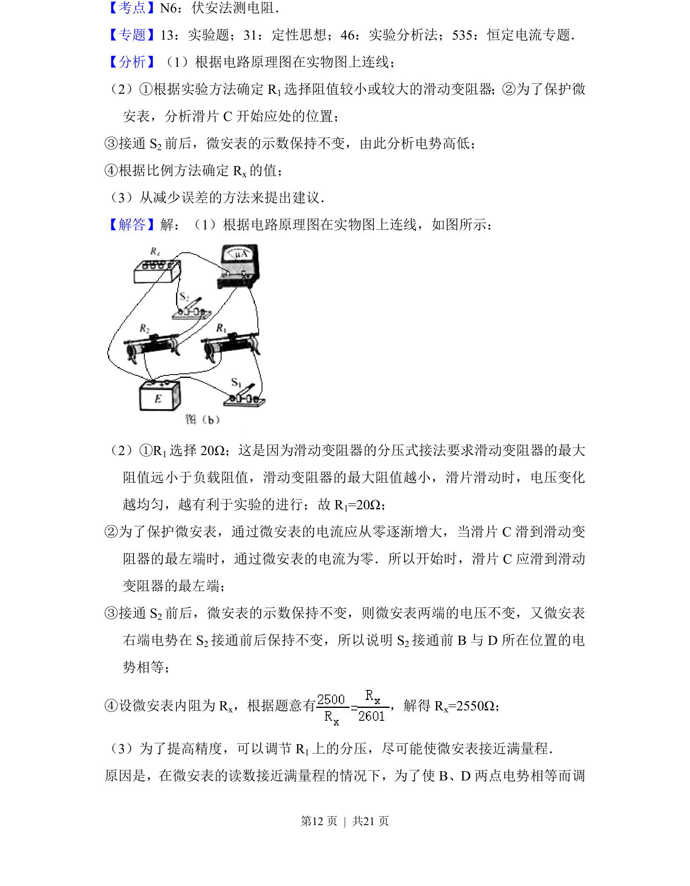
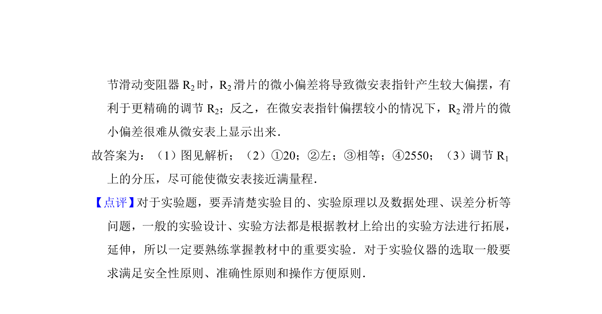

## 题面

## 摘要

设计并连接用微安表和滑动变阻器测电源电动势及内阻的电路，完成填空并分析测量精度。

## 关联考点

- [[695-电路实验|电路实验]]
- [[307-电动势|电动势]]
- [[291-内阻|内阻]]
- [[141-欧姆定律-初中|欧姆定律]]

## 答案与解析

> 📄 原 PDF 第 11 页：`素材/真题/吉林/2008-2024·（吉林）物理高考真题/2017年高考物理试卷（新课标Ⅱ）（解析卷）.pdf`

<!-- 题干文本-start -->
## 题干文本
10．（9分）某同学利用如图（a）所示的电路测量一微安表（量程为100μA，
内阻大约为2500Ω）的内阻。可使用的器材有：两个滑动变阻器R 1，R2（其
中一个阻值为20Ω，另一个阻值为2000Ω）；电阻箱R z（最大阻值为
99999.9Ω）；电源E（电动势约为1.5V）；单刀开关S 1和S 2．C、D分别为
两个滑动变阻器的滑片。
（1）按原理图（a）将图（b）中的实物连线。
（2）完成下列填空：
①R1的阻值为　20　Ω（填“20”或“2000”）
②为了保护微安表，开始时将R 1的滑片C滑到接近图（a）中的滑动变阻器的　
左　端（填“左”或“右”）对应的位置；将R 2的滑片D置于中间位置附近。
③将电阻箱R z的阻值置于2500.0Ω，接通S 1．将R 1的滑片置于适当位置，再反
复调节R 2的滑片D的位置、最终使得接通S 2前后，微安表的示数保持不变，
这说明S 2接通前B与D所在位置的电势　相等　（填“相等”或“不相等”）
④将电阻箱R z和微安表位置对调，其他条件保持不变，发现将R z的阻值置于
2601.0Ω时，在接通S 2前后，微安表的示数也保持不变。待微安表的内阻为　
2550　Ω（结果保留到个位）。
（3） 写出一条提高测量微安表内阻精度的建议：　调节R1上的分压，尽可能使
微安表接近满量程。　。
<!-- 题干文本-end -->

<!-- 解析文本-start -->
## 解析文本

<!-- 解析文本-end -->
