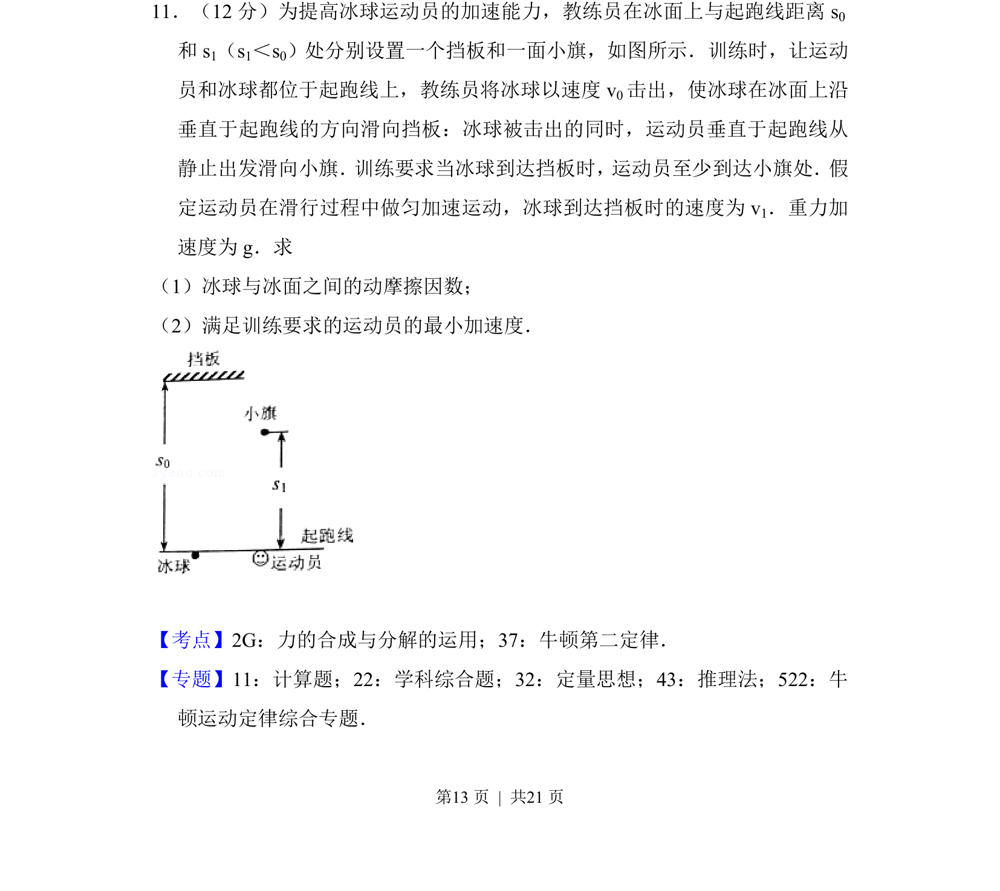
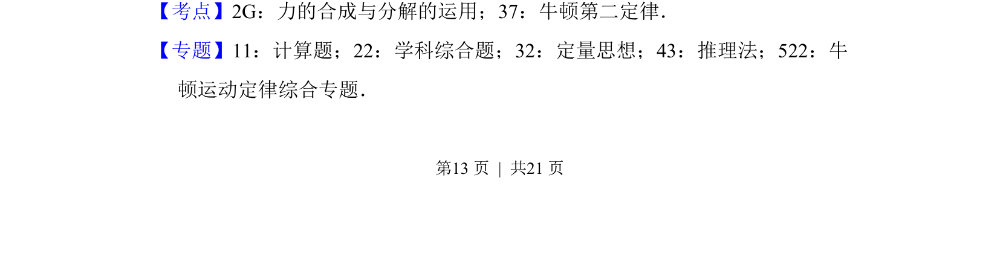
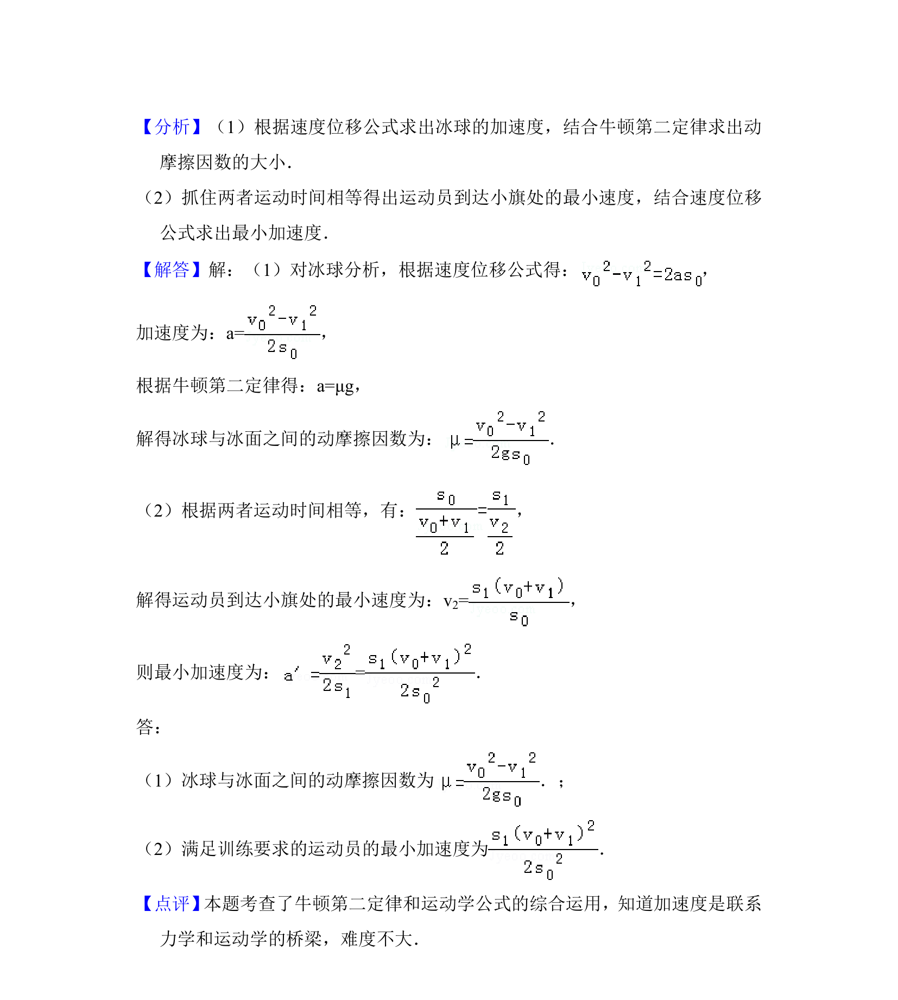

## 题面

## 摘要

冰球运动员从起跑线加速滑行，冰球碰挡板后竖直弹回，综合求冰面动摩擦因数和运动员最小加速度。

## 关联考点

- [[牛顿定律]]
- [[运动学]]
- [[081-摩擦力|摩擦力]]
- [[动力学]]

## 答案与解析

> 📄 原 PDF 第 13 页：`素材/真题/吉林/2008-2024·（吉林）物理高考真题/2017年高考物理试卷（新课标Ⅱ）（解析卷）.pdf`
