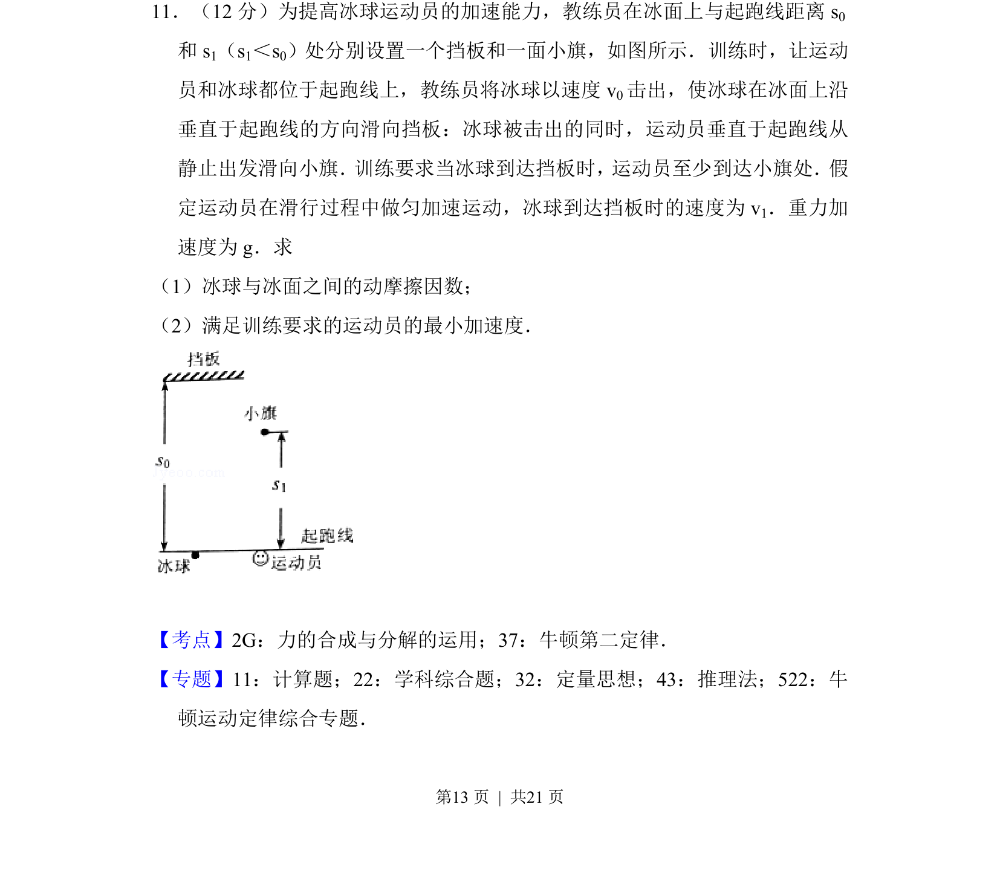
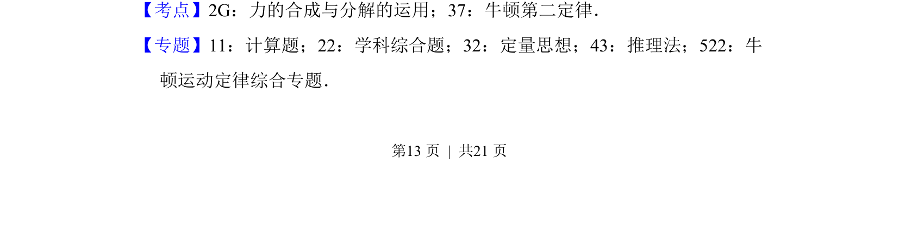
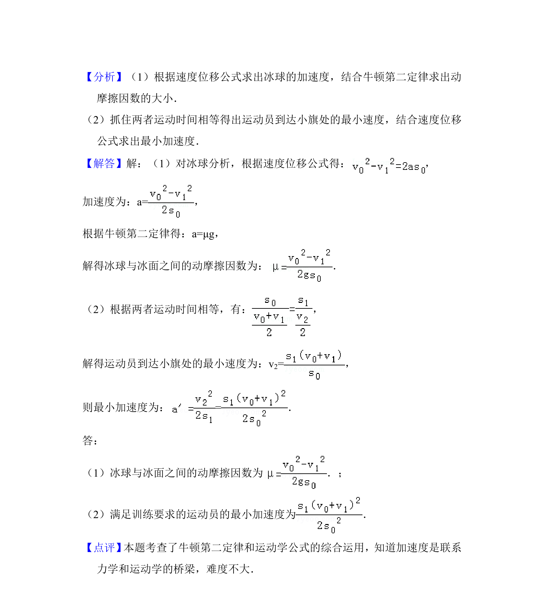

## 题面

## 摘要

冰球运动员从起跑线加速滑行，冰球碰挡板后竖直弹回，综合求冰面动摩擦因数和运动员最小加速度。

## 关联考点

- [[662-牛顿定律|牛顿定律]]
- [[732-运动学|运动学]]
- [[081-摩擦力|摩擦力]]
- [[535-动力学|动力学]]

## 答案与解析

> 📄 原 PDF 第 13 页：`素材/真题/吉林/2008-2024·（吉林）物理高考真题/2017年高考物理试卷（新课标Ⅱ）（解析卷）.pdf`

<!-- 题干文本-start -->
## 题干文本
11．（12分）为提高冰球运动员的加速能力，教练员在冰面上与起跑线距离s 0
和s 1（s1＜s0）处分别设置一个挡板和一面小旗，如图所示．训练时，让运动
员和冰球都位于起跑线上，教练员将冰球以速度v 0击出，使冰球在冰面上沿
垂直于起跑线的方向滑向挡板：冰球被击出的同时，运动员垂直于起跑线从
静止出发滑向小旗．训练要求当冰球到达挡板时，运动员至少到达小旗处．假
定运动员在滑行过程中做匀加速运动，冰球到达挡板时的速度为v 1．重力加
速度为g．求
（1）冰球与冰面之间的动摩擦因数；
（2）满足训练要求的运动员的最小加速度．
<!-- 题干文本-end -->

<!-- 解析文本-start -->
## 解析文本
【考点】2G：力的合成与分解的运用；37：牛顿第二定律．菁优网版权所有
【专题】11：计算题；22：学科综合题；32：定量思想；43：推理法；522：牛
顿运动定律综合专题．
<!-- 解析文本-end -->
