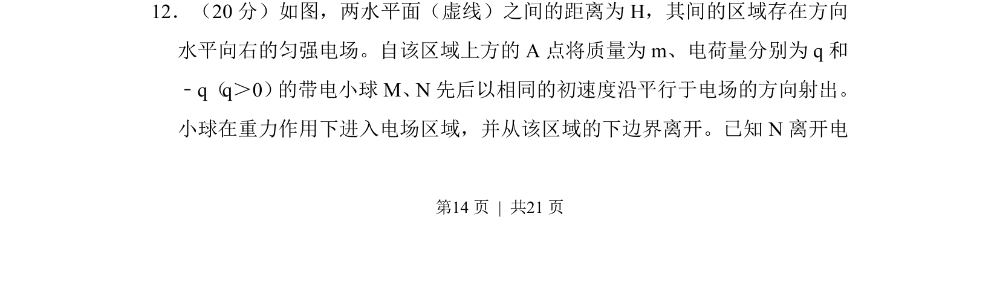
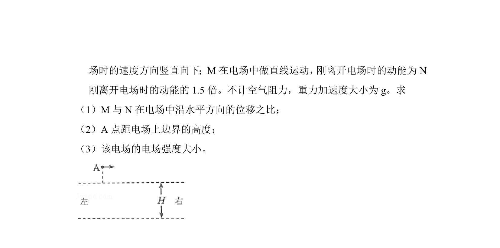
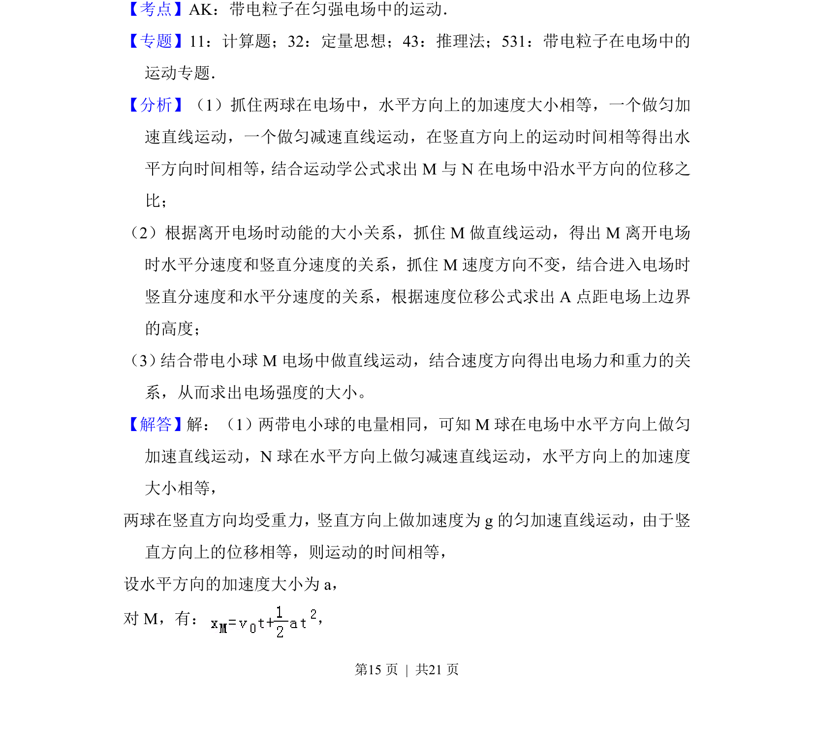
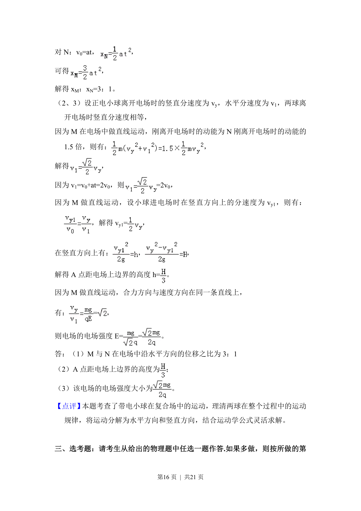

## 题面

## 摘要

正负电荷小球从同一点以相同初速度射入匀强电场，一做直线运动一做曲线运动，求水平位移比、入射高度和电场强度。

## 关联考点

- [[671-电场|电场]]
- [[599-带电粒子运动|带电粒子运动]]
- [[251-动能定理|动能定理]]
- [[544-匀变速运动|匀变速运动]]

## 答案与解析

> 📄 原 PDF 第 14 页：`素材/真题/吉林/2008-2024·（吉林）物理高考真题/2017年高考物理试卷（新课标Ⅱ）（解析卷）.pdf`
