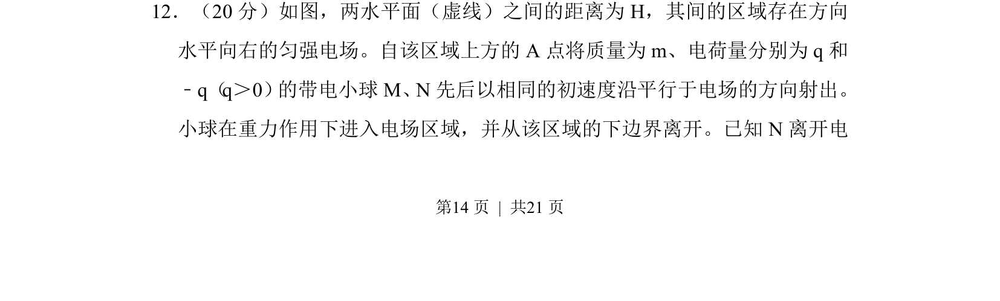
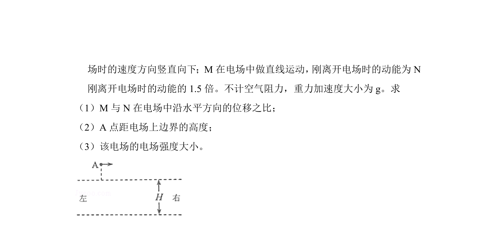
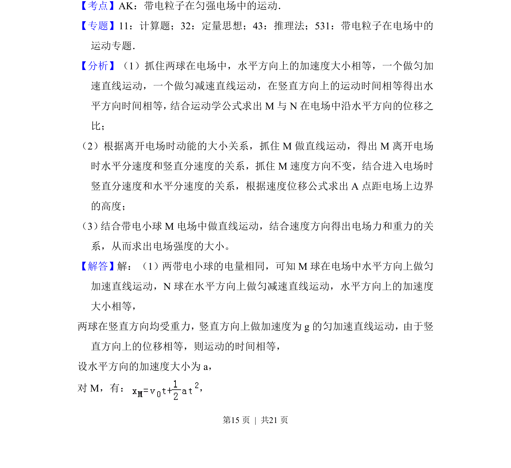
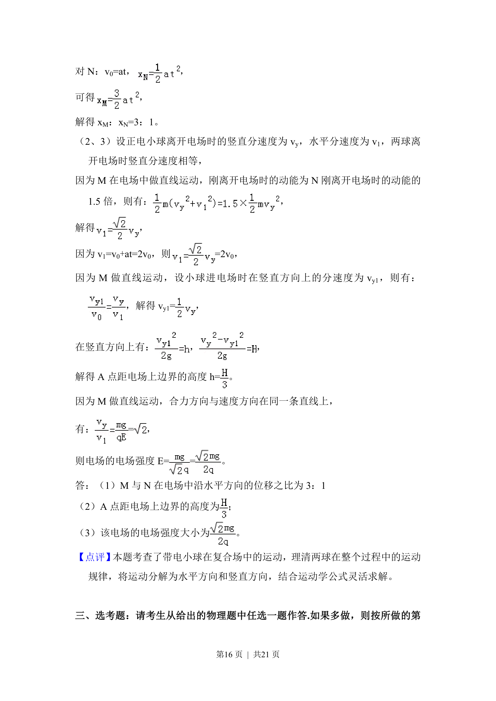

## 题面

## 摘要

正负电荷小球从同一点以相同初速度射入匀强电场，一做直线运动一做曲线运动，求水平位移比、入射高度和电场强度。

## 关联考点

- [[671-电场|电场]]
- [[599-带电粒子运动|带电粒子运动]]
- [[251-动能定理|动能定理]]
- [[544-匀变速运动|匀变速运动]]

## 答案与解析

> 📄 原 PDF 第 14 页：`素材/真题/吉林/2008-2024·（吉林）物理高考真题/2017年高考物理试卷（新课标Ⅱ）（解析卷）.pdf`

<!-- 题干文本-start -->
## 题干文本
12．（20分）如图，两水平面（虚线）之间的距离为H，其间的区域存在方向
水平向右的匀强电场。自该区域上方的A点将质量为m、电荷量分别为q和
﹣q（q＞0） 的带电小球M、N先后以相同的初速度沿平行于电场的方向射出。
小球在重力作用下进入电场区域，并从该区域的下边界离开。已知N离开电
<!-- 题干文本-end -->

<!-- 解析文本-start -->
## 解析文本

<!-- 解析文本-end -->
