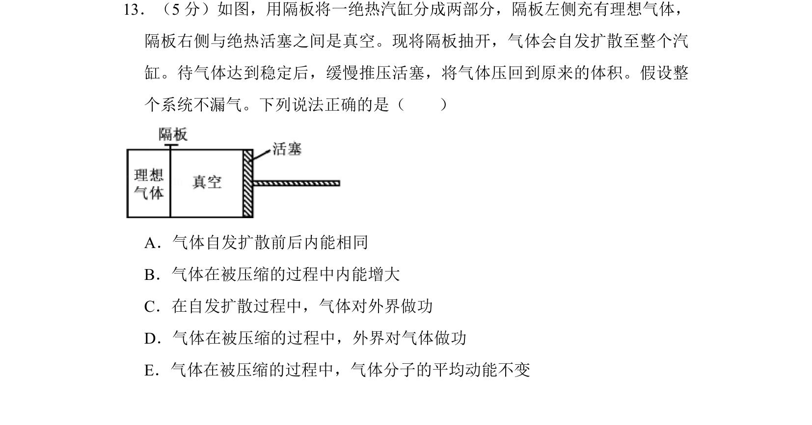
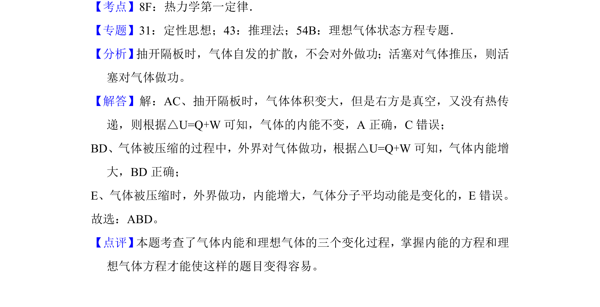

## 题面

## 摘要

理想气体自由膨胀后再被等温压缩回原体积，判断各阶段内能、功和分子平均动能的变化。

## 关联考点

- [[658-热学|热学]]
- [[639-气体状态变化|气体状态变化]]
- [[440-热力学第一定律|热力学第一定律]]
- [[129-分子动理论|分子动理论]]

## 答案与解析

> 📄 原 PDF 第 17 页：`素材/真题/吉林/2008-2024·（吉林）物理高考真题/2017年高考物理试卷（新课标Ⅱ）（解析卷）.pdf`

<!-- 题干文本-start -->
## 题干文本
13．（5分）如图，用隔板将一绝热汽缸分成两部分，隔板左侧充有理想气体，
隔板右侧与绝热活塞之间是真空。现将隔板抽开，气体会自发扩散至整个汽
缸。待气体达到稳定后，缓慢推压活塞，将气体压回到原来的体积。假设整
个系统不漏气。下列说法正确的是（　　）
A．气体自发扩散前后内能相同
B．气体在被压缩的过程中内能增大
C．在自发扩散过程中，气体对外界做功
D．气体在被压缩的过程中，外界对气体做功
E．气体在被压缩的过程中，气体分子的平均动能不变
<!-- 题干文本-end -->

<!-- 解析文本-start -->
## 解析文本
【考点】8F：热力学第一定律．菁优网版权所有
【专题】31：定性思想；43：推理法；54B：理想气体状态方程专题．
【分析】 抽开隔板时，气体自发的扩散，不会对外做功；活塞对气体推压，则活
塞对气体做功。
【解答】解：AC、抽开隔板时，气体体积变大，但是右方是真空，又没有热传
递，则根据△U=Q+W可知，气体的内能不变，A正确，C错误；
BD、气体被压缩的过程中，外界对气体做功，根据△U=Q+W可知，气体内能增
大，BD正确；
E、气体被压缩时，外界做功，内能增大，气体分子平均动能是变化的，E错误。
故选：ABD。
【点评】 本题考查了气体内能和理想气体的三个变化过程，掌握内能的方程和理
想气体方程才能使这样的题目变得容易。
<!-- 解析文本-end -->
