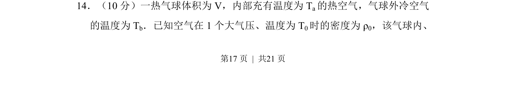
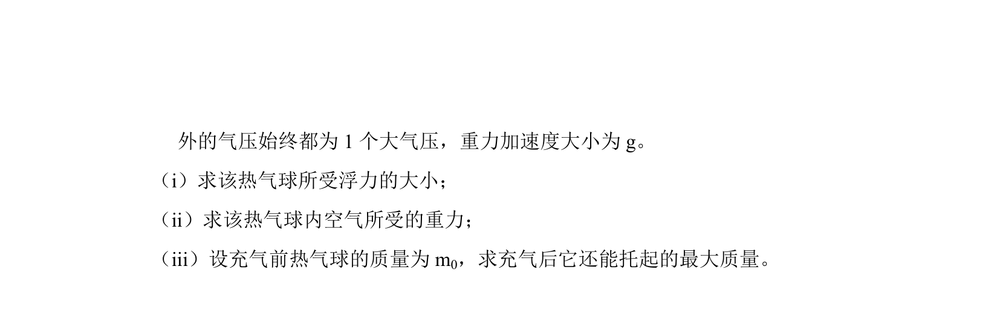
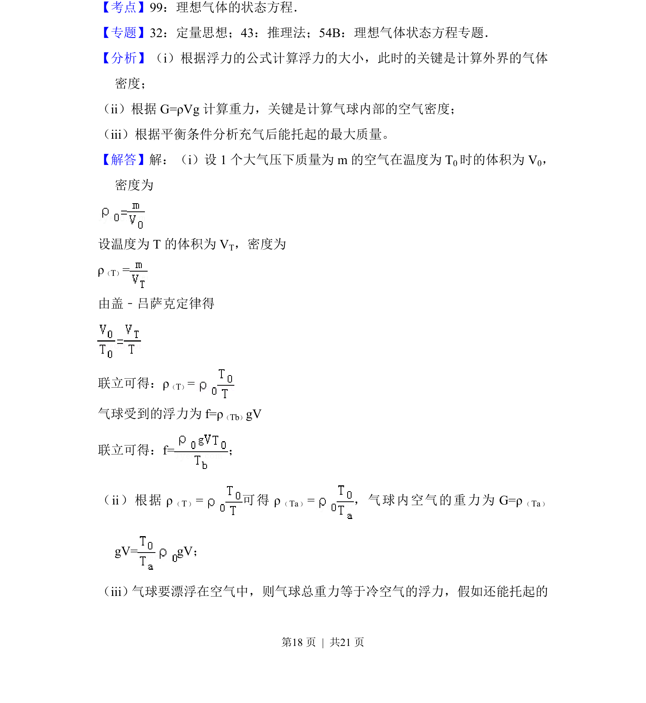
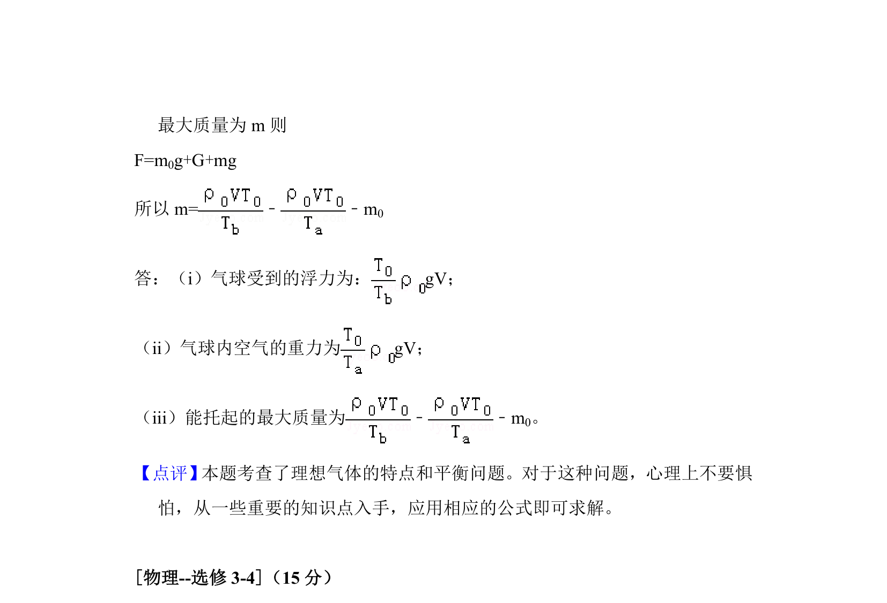

## 题面

## 摘要

热气球内充有高温空气，利用气体状态方程求热气球所受浮力、内部气体重力和充气后可托起的最大质量。

## 关联考点

- [[658-热学|热学]]
- [[446-理想气体状态方程|气体状态方程]]
- [[092-浮力|浮力]]
- [[530-力学|力学]]

## 答案与解析

> 📄 原 PDF 第 17 页：`素材/真题/吉林/2008-2024·（吉林）物理高考真题/2017年高考物理试卷（新课标Ⅱ）（解析卷）.pdf`
