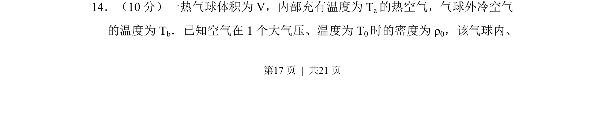
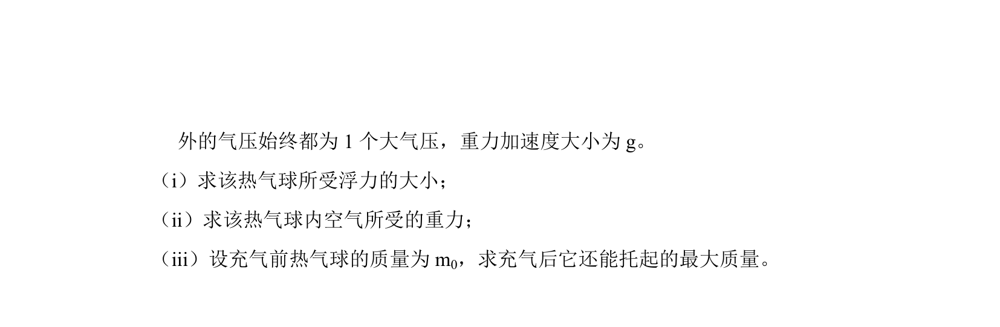
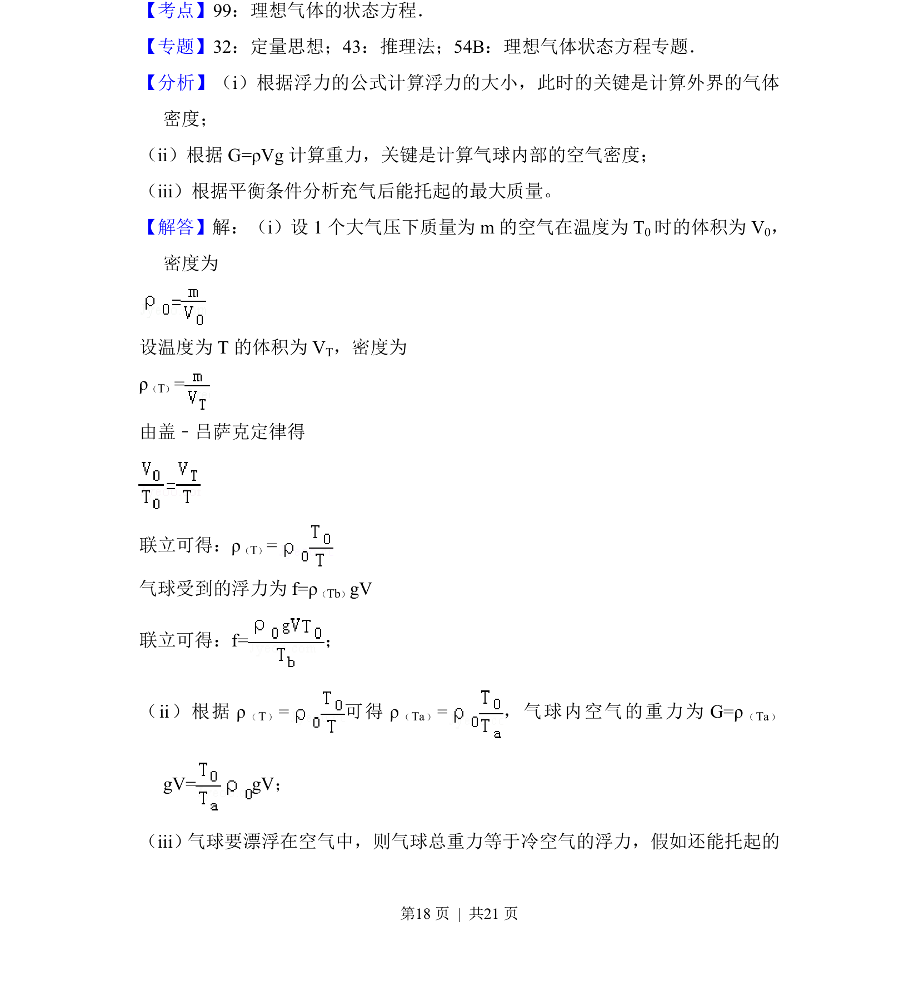
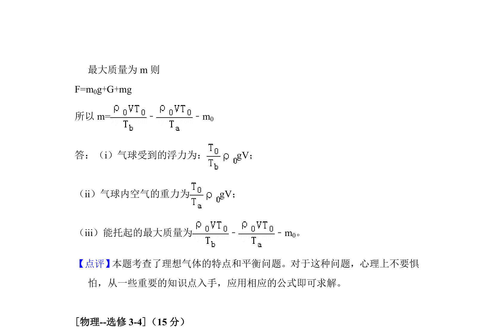

## 题面

## 摘要

热气球内充有高温空气，利用气体状态方程求热气球所受浮力、内部气体重力和充气后可托起的最大质量。

## 关联考点

- [[658-热学|热学]]
- [[446-理想气体状态方程|气体状态方程]]
- [[092-浮力|浮力]]
- [[530-力学|力学]]

## 答案与解析

> 📄 原 PDF 第 17 页：`素材/真题/吉林/2008-2024·（吉林）物理高考真题/2017年高考物理试卷（新课标Ⅱ）（解析卷）.pdf`

<!-- 题干文本-start -->
## 题干文本
14．（10分）一热气球体积为V，内部充有温度为T a的热空气，气球外冷空气
的温度为T b．已知空气在1个大气压、温度为T 0时的密度为ρ 0，该气球内、
<!-- 题干文本-end -->

<!-- 解析文本-start -->
## 解析文本

<!-- 解析文本-end -->
