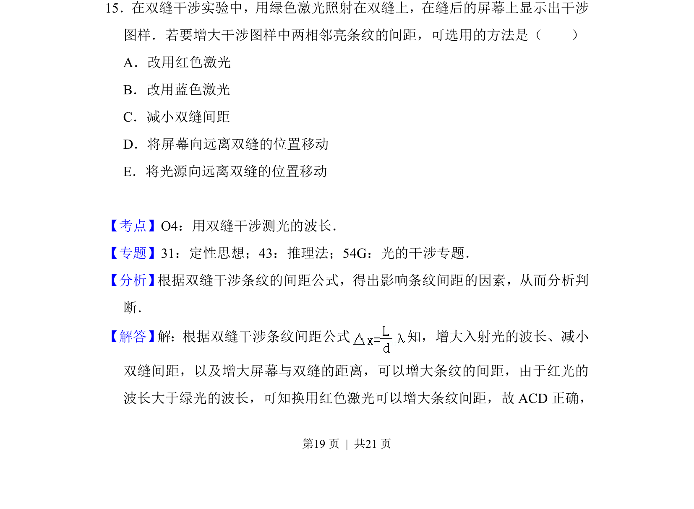
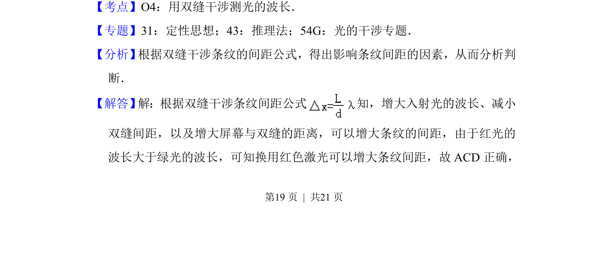
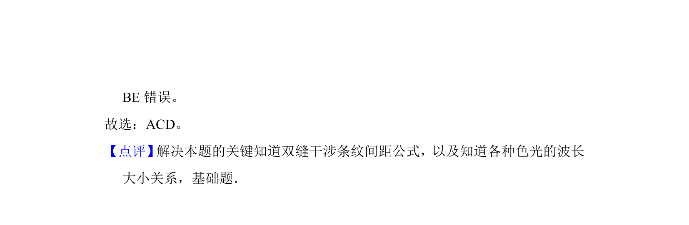

## 题面

## 摘要

双缝干涉实验中，分析改变激光颜色、缝间距、屏距等操作对相邻亮纹间距的影响。

## 关联考点

- [[644-波动光学|波动光学]]
- [[552-双缝干涉|双缝干涉]]
- [[521-光的波动性|光的波动性]]
- [[519-光学|光学]]

## 答案与解析

> 📄 原 PDF 第 19 页：`素材/真题/吉林/2008-2024·（吉林）物理高考真题/2017年高考物理试卷（新课标Ⅱ）（解析卷）.pdf`

<!-- 题干文本-start -->
## 题干文本
15．在双缝干涉实验中，用绿色激光照射在双缝上，在缝后的屏幕上显示出干涉
图样．若要增大干涉图样中两相邻亮条纹的间距，可选用的方法是（　　）
A．改用红色激光
B．改用蓝色激光
C．减小双缝间距
D．将屏幕向远离双缝的位置移动
E．将光源向远离双缝的位置移动
<!-- 题干文本-end -->

<!-- 解析文本-start -->
## 解析文本
【考点】O4：用双缝干涉测光的波长．菁优网版权所有
【专题】31：定性思想；43：推理法；54G：光的干涉专题．
【分析】 根据双缝干涉条纹的间距公式，得出影响条纹间距的因素，从而分析判
断．
【解答】 解：根据双缝干涉条纹间距公式 知，增大入射光的波长、减小
双缝间距，以及增大屏幕与双缝的距离，可以增大条纹的间距，由于红光的
波长大于绿光的波长，可知换用红色激光可以增大条纹间距，故ACD正确，
<!-- 解析文本-end -->
