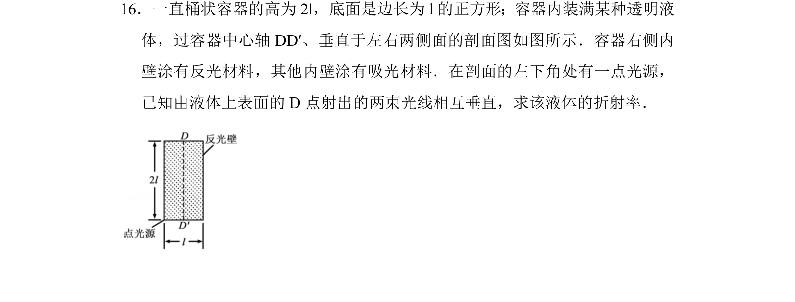
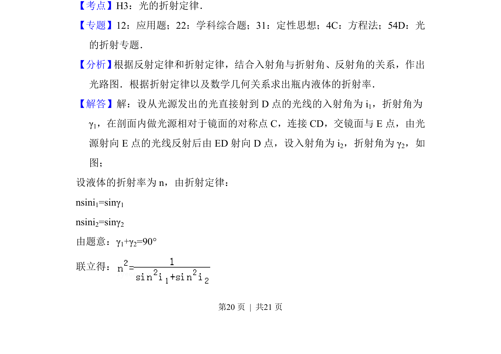
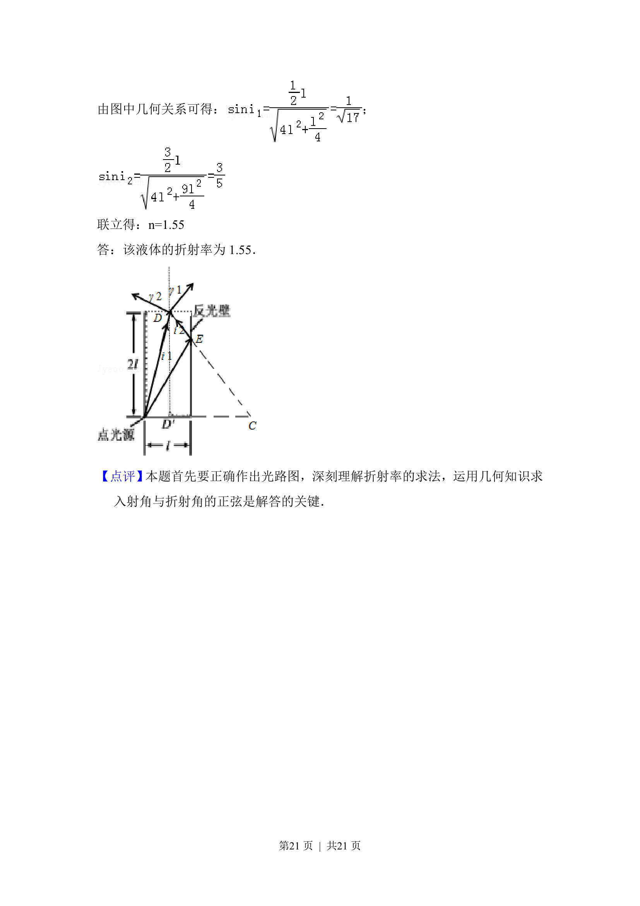

## 题面

## 摘要

桶状透明液体容器中，从底部点光源出发经反光右壁后由上表面D点射出两束相互垂直的光线，求液体折射率。

## 关联考点

- [[519-光学|光学]]
- [[026-折射定律|折射定律]]
- [[343-全反射|全反射]]
- [[455-几何光学|几何光学]]

## 答案与解析

> 📄 原 PDF 第 20 页：`素材/真题/吉林/2008-2024·（吉林）物理高考真题/2017年高考物理试卷（新课标Ⅱ）（解析卷）.pdf`
