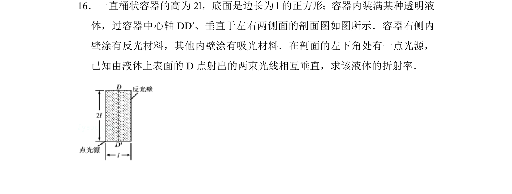
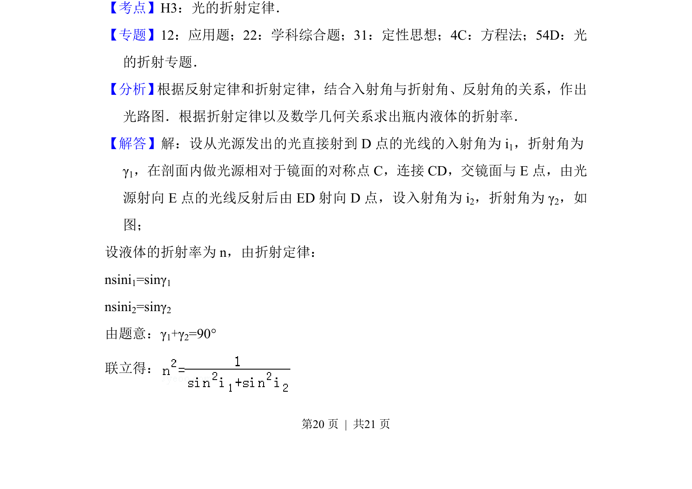
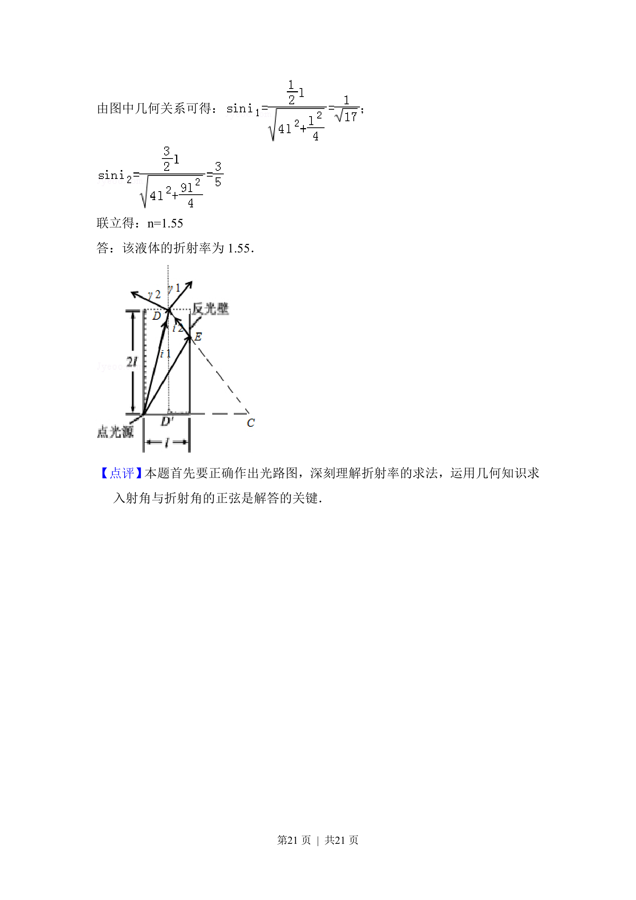

## 题面

## 摘要

桶状透明液体容器中，从底部点光源出发经反光右壁后由上表面D点射出两束相互垂直的光线，求液体折射率。

## 关联考点

- [[519-光学|光学]]
- [[026-折射定律|折射定律]]
- [[343-全反射|全反射]]
- [[455-几何光学|几何光学]]

## 答案与解析

> 📄 原 PDF 第 20 页：`素材/真题/吉林/2008-2024·（吉林）物理高考真题/2017年高考物理试卷（新课标Ⅱ）（解析卷）.pdf`

<!-- 题干文本-start -->
## 题干文本
16．一直桶状容器的高为2l，底面是边长为l的正方形；容器内装满某种透明液
体，过容器中心轴DD′、垂直于左右两侧面的剖面图如图所示．容器右侧内
壁涂有反光材料，其他内壁涂有吸光材料．在剖面的左下角处有一点光源，
已知由液体上表面的D点射出的两束光线相互垂直，求该液体的折射率．
<!-- 题干文本-end -->

<!-- 解析文本-start -->
## 解析文本
【考点】H3：光的折射定律．菁优网版权所有
【专题】12：应用题；22：学科综合题；31：定性思想；4C：方程法；54D：光
的折射专题．
【分析】 根据反射定律和折射定律，结合入射角与折射角、反射角的关系，作出
光路图．根据折射定律以及数学几何关系求出瓶内液体的折射率．
【解答】解：设从光源发出的光直接射到D点的光线的入射角为i 1，折射角为
γ1，在剖面内做光源相对于镜面的对称点C，连接CD，交镜面与E点，由光
源射向E点的光线反射后由ED射向D点，设入射角为i 2，折射角为γ 2，如
图；
设液体的折射率为n，由折射定律：
nsini1=sinγ1
nsini2=sinγ2
由题意：γ1+γ2=90°
联立得：
<!-- 解析文本-end -->
