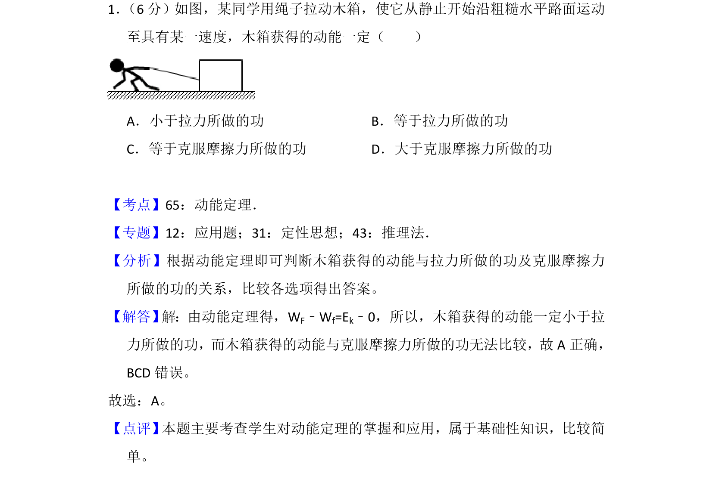
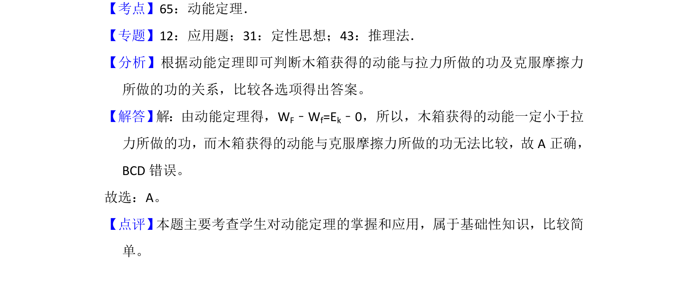

## 题面

## 摘要

根据动能定理分析拉力做功与动能变化的关系，判断木箱获得动能的大小。

## 关联考点

- [[251-动能定理|动能定理]]
- [[515-做功与能量变化|做功与能量变化]]

## 答案与解析

> 📄 原 PDF 第 1 页：`素材/真题/吉林/2008-2024·（吉林）物理高考真题/2018年高考物理试卷（新课标Ⅱ）（解析卷）.pdf`

<!-- 题干文本-start -->
## 题干文本
1． （6分）如图，某同学用绳子拉动木箱，使它从静止开始沿粗糙水平路面运动
至具有某一速度，木箱获得的动能一定（　　）
A．小于拉力所做的功B．等于拉力所做的功
C．等于克服摩擦力所做的功D．大于克服摩擦力所做的功
<!-- 题干文本-end -->

<!-- 解析文本-start -->
## 解析文本
【考点】65：动能定理．菁优网版权所有
【专题】12：应用题；31：定性思想；43：推理法．
【分析】根据动能定理即可判断木箱获得的动能与拉力所做的功及克服摩擦力
所做的功的关系，比较各选项得出答案。
【解答】 解：由动能定理得，WF﹣Wf=Ek﹣0，所以，木箱获得的动能一定小于拉
力所做的功，而木箱获得的动能与克服摩擦力所做的功无法比较，故A正确，
BCD错误。
故选：A。
【点评】 本题主要考查学生对动能定理的掌握和应用，属于基础性知识，比较简
单。
<!-- 解析文本-end -->
