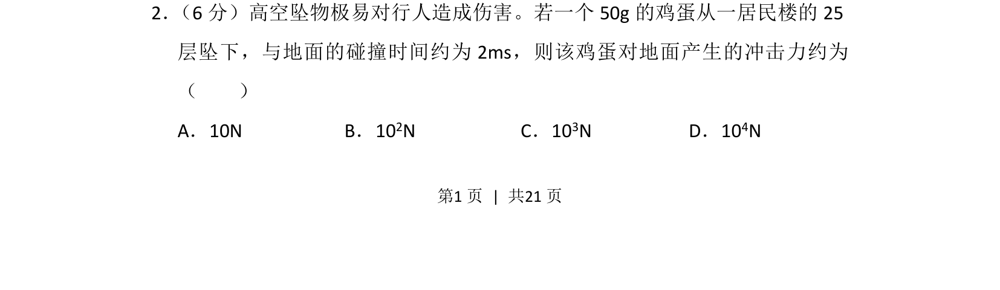
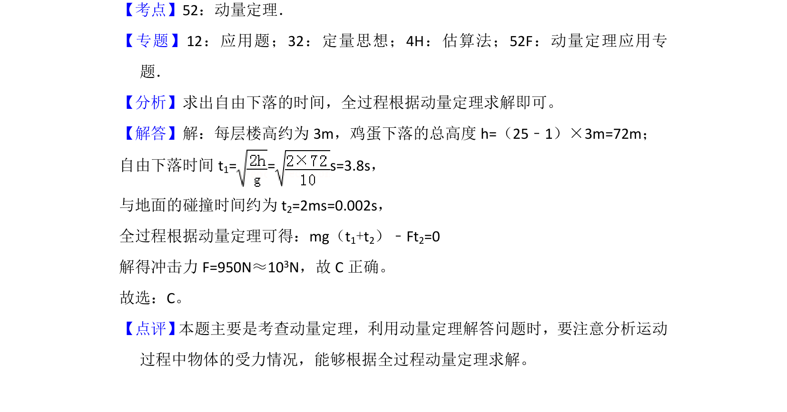

## 题面

## 摘要

估算鸡蛋坠落冲击力，涉及运动学与动量定理的近似计算

## 关联考点

- [[346-动量|动量]]
- [[345-冲量|冲量]]
- [[046-近似数|估算]]
- [[618-数量级|数量级]]

## 答案与解析

> 📄 原 PDF 第 1 页：`素材/真题/吉林/2008-2024·（吉林）物理高考真题/2018年高考物理试卷（新课标Ⅱ）（解析卷）.pdf`
