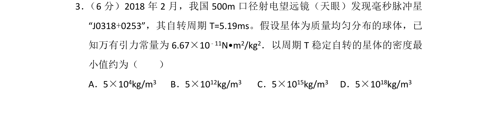
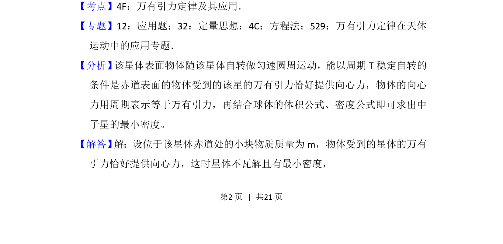
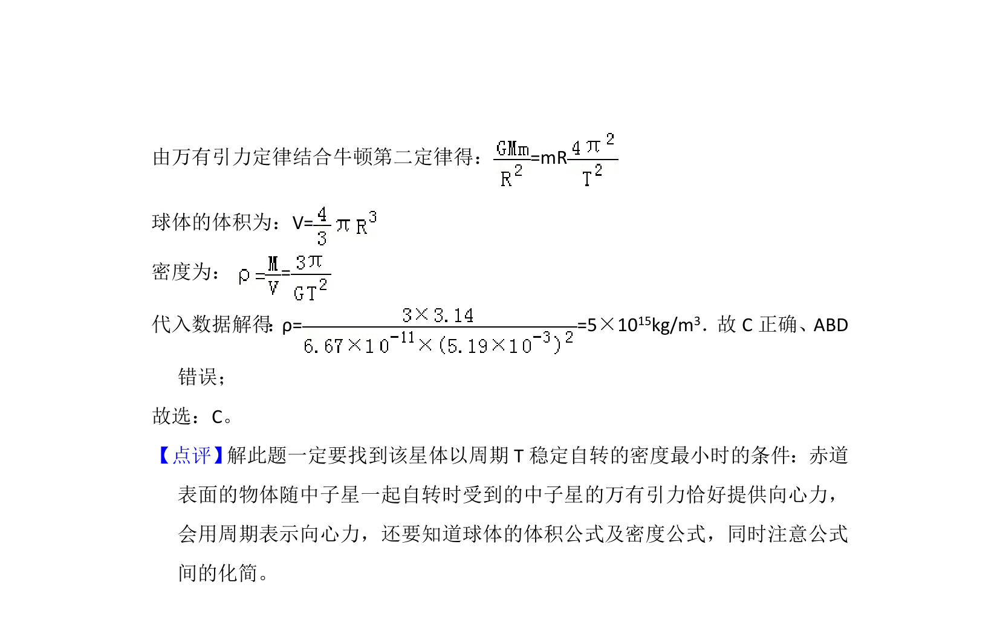

## 题面

## 摘要

通过万有引力提供向心力计算稳定自转星体的最小密度。

## 关联考点

- [[246-万有引力定律|万有引力定律]]
- [[256-向心力|向心力]]
- [[019-密度|密度]]

## 答案与解析

> 📄 原 PDF 第 2 页：`素材/真题/吉林/2008-2024·（吉林）物理高考真题/2018年高考物理试卷（新课标Ⅱ）（解析卷）.pdf`

<!-- 题干文本-start -->
## 题干文本
3． （6分）2018年2月，我国500m口径射电望远镜（天眼）发现毫秒脉冲星
“J0318+0253”，其自转周期T=5.19ms。假设星体为质量均匀分布的球体，已
知万有引力常量为6.67×10 ﹣11N•m2/kg2．以周期T稳定自转的星体的密度最
小值约为（　　）
A．5×104kg/m3 B．5×1012kg/m3 C．5×1015kg/m3 D．5×1018kg/m3
<!-- 题干文本-end -->

<!-- 解析文本-start -->
## 解析文本
【考点】4F：万有引力定律及其应用．菁优网版权所有
【专题】12：应用题；32：定量思想；4C：方程法；529：万有引力定律在天体
运动中的应用专题．
【分析】 该星体表面物体随该星体自转做匀速圆周运动，能以周期T稳定自转的
条件是赤道表面的物体受到的该星的万有引力恰好提供向心力，物体的向心
力用周期表示等于万有引力，再结合球体的体积公式、密度公式即可求出中
子星的最小密度。
【解答】 解：设位于该星体赤道处的小块物质质量为m，物体受到的星体的万有
引力恰好提供向心力，这时星体不瓦解且有最小密度，
<!-- 解析文本-end -->
