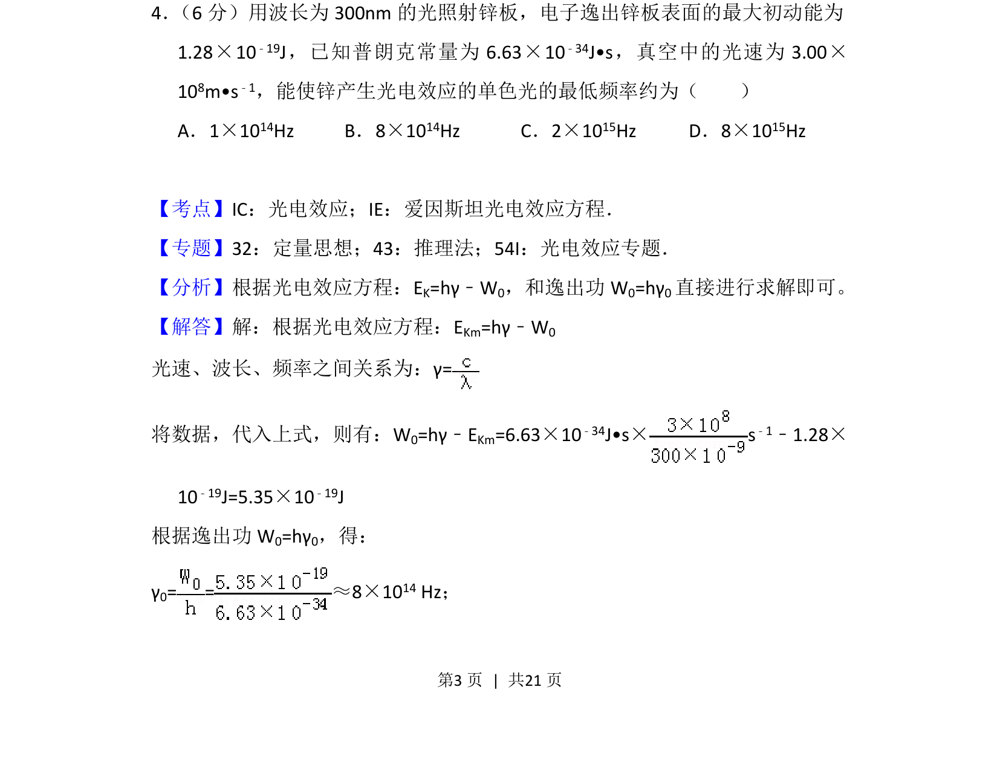

## 题面

## 摘要

本题考查光电效应现象及爱因斯坦方程的应用，通过求解逸出功和极限频率计算最低频率。

## 关联考点

- [[417-光电效应|光电效应]]
- [[爱因斯坦光电效应方程]]
- [[逸出功]]
- [[143-频数分布|频率]]

## 答案与解析

> 📄 原 PDF 第 3 页：`素材/真题/吉林/2008-2024·（吉林）物理高考真题/2018年高考物理试卷（新课标Ⅱ）（解析卷）.pdf`
