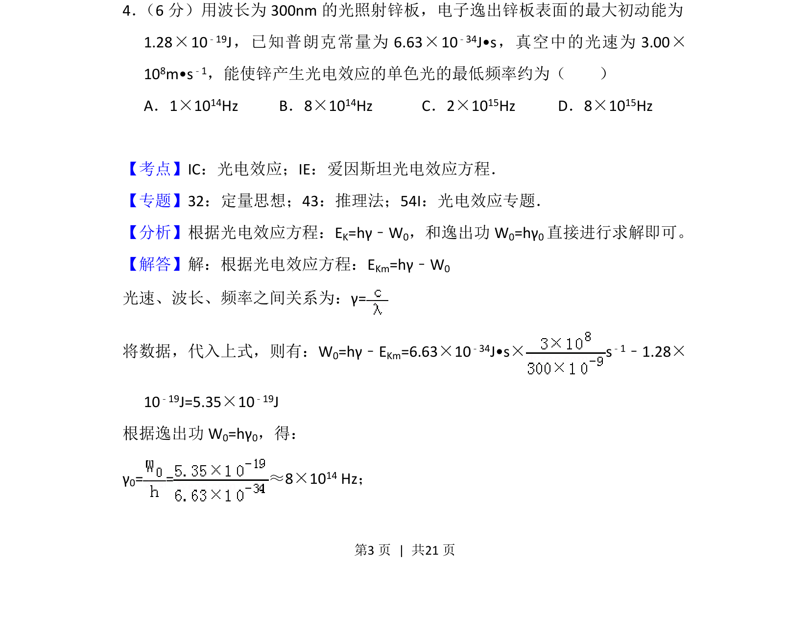
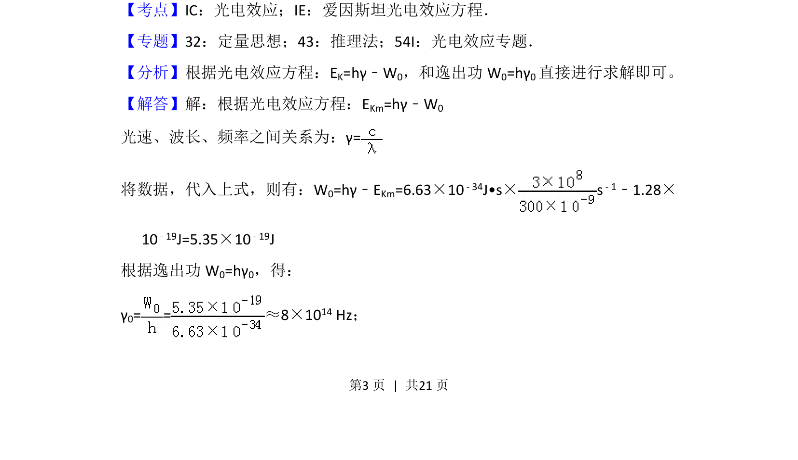
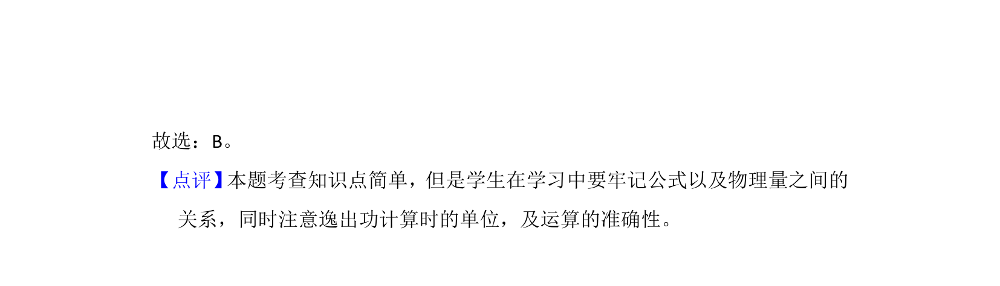

## 题面

## 摘要

本题考查光电效应现象及爱因斯坦方程的应用，通过求解逸出功和极限频率计算最低频率。

## 关联考点

- [[417-光电效应|光电效应]]
- [[660-爱因斯坦光电效应方程|爱因斯坦光电效应方程]]
- [[745-逸出功|逸出功]]
- [[143-频数分布|频率]]

## 答案与解析

> 📄 原 PDF 第 3 页：`素材/真题/吉林/2008-2024·（吉林）物理高考真题/2018年高考物理试卷（新课标Ⅱ）（解析卷）.pdf`

<!-- 题干文本-start -->
## 题干文本
4． （6分）用波长为300nm的光照射锌板，电子逸出锌板表面的最大初动能为
1.28×10 ﹣19J，已知普朗克常量为6.63×10 ﹣34J•s，真空中的光速为3.00×
108m•s﹣1，能使锌产生光电效应的单色光的最低频率约为（　　）
A．1×1014Hz B．8×10 14Hz C．2×10 15Hz D．8×10 15Hz
<!-- 题干文本-end -->

<!-- 解析文本-start -->
## 解析文本
【考点】IC：光电效应；IE：爱因斯坦光电效应方程．菁优网版权所有
【专题】32：定量思想；43：推理法；54I：光电效应专题．
【分析】根据光电效应方程：EK=hγ﹣W0，和逸出功W 0=hγ0直接进行求解即可。
【解答】解：根据光电效应方程：EKm=hγ﹣W0
光速、波长、频率之间关系为：γ=
将数据，代入上式，则有：W0=hγ﹣EKm=6.63×10﹣34J•s×s ﹣1﹣1.28×
10﹣19J=5.35×10﹣19J
根据逸出功W 0=hγ0，得：
γ0= =≈8×10 14 Hz；
<!-- 解析文本-end -->
