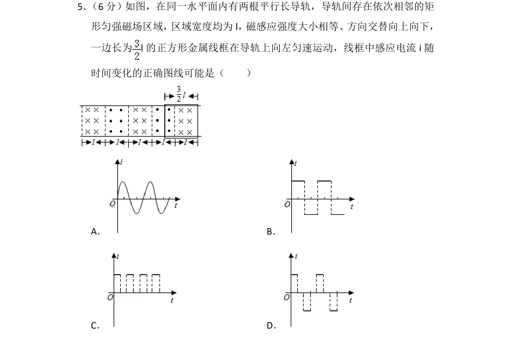
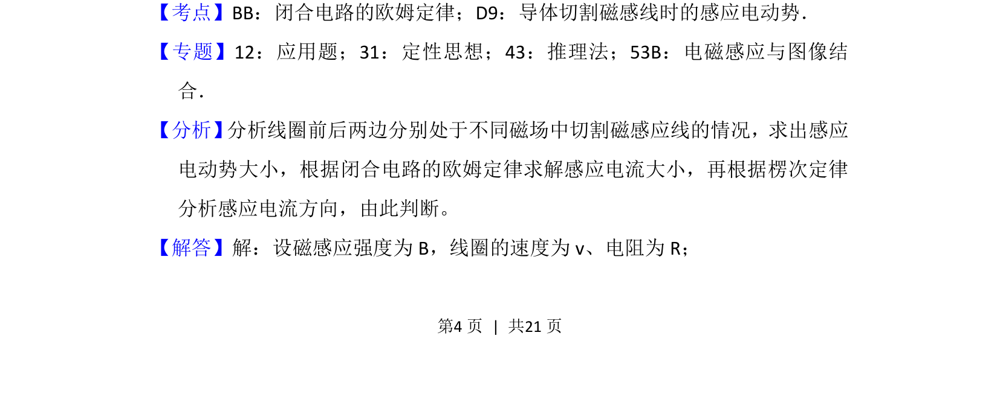
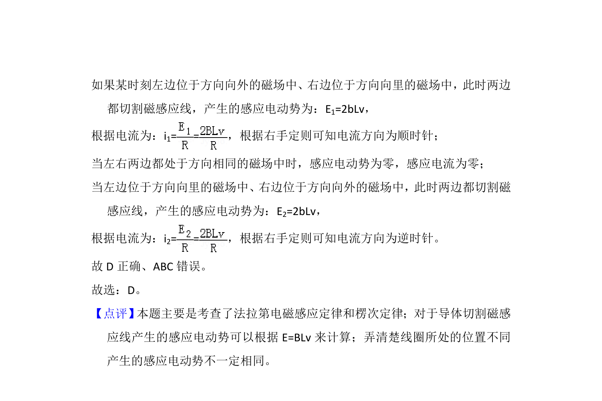

## 题面

## 摘要

金属线框在交替磁场中匀速运动，根据电动势和楞次定律判断感应电流图像。

## 关联考点

- [[747-闭合电路的欧姆定律|闭合电路的欧姆定律]]
- [[590-导体切割磁感线时的感应电动势|导体切割磁感线时的感应电动势]]
- [[393-楞次定律|楞次定律]]
- [[687-电磁感应与图像结合|电磁感应与图像结合]]

## 答案与解析

> 📄 原 PDF 第 4 页：`素材/真题/吉林/2008-2024·（吉林）物理高考真题/2018年高考物理试卷（新课标Ⅱ）（解析卷）.pdf`
