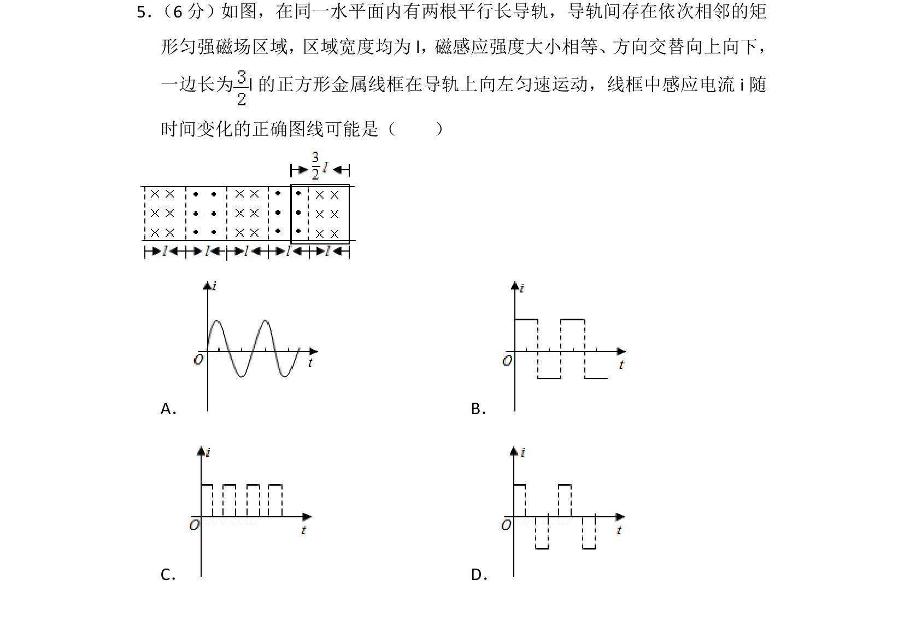
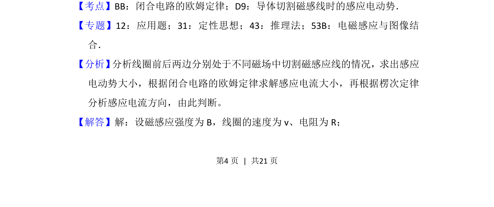
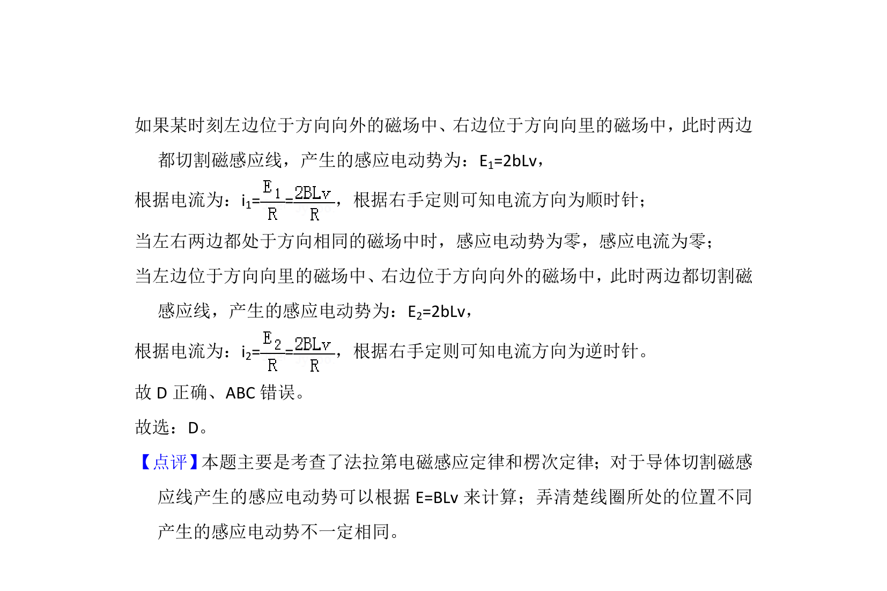

## 题面

## 摘要

金属线框在交替磁场中匀速运动，根据电动势和楞次定律判断感应电流图像。

## 关联考点

- [[332-闭合电路欧姆定律|闭合电路的欧姆定律]]
- [[590-导体切割磁感线时的感应电动势|导体切割磁感线时的感应电动势]]
- [[393-楞次定律|楞次定律]]
- [[686-电磁感应与图像结合|电磁感应与图像结合]]

## 答案与解析

> 📄 原 PDF 第 4 页：`素材/真题/吉林/2008-2024·（吉林）物理高考真题/2018年高考物理试卷（新课标Ⅱ）（解析卷）.pdf`

<!-- 题干文本-start -->
## 题干文本
5． （6分）如图，在同一水平面内有两根平行长导轨，导轨间存在依次相邻的矩
形匀强磁场区域，区域宽度均为l，磁感应强度大小相等、方向交替向上向下，
一边长为l的正方形金属线框在导轨上向左匀速运动，线框中感应电流i随
时间变化的正确图线可能是（　　）
A．B．
C．D．
<!-- 题干文本-end -->

<!-- 解析文本-start -->
## 解析文本
【考点】BB：闭合电路的欧姆定律；D9：导体切割磁感线时的感应电动势．菁优网版权所有
【专题】12：应用题；31：定性思想；43：推理法；53B：电磁感应与图像结
合．
【分析】 分析线圈前后两边分别处于不同磁场中切割磁感应线的情况，求出感应
电动势大小，根据闭合电路的欧姆定律求解感应电流大小，再根据楞次定律
分析感应电流方向，由此判断。
【解答】解：设磁感应强度为B，线圈的速度为v、电阻为R；
<!-- 解析文本-end -->
