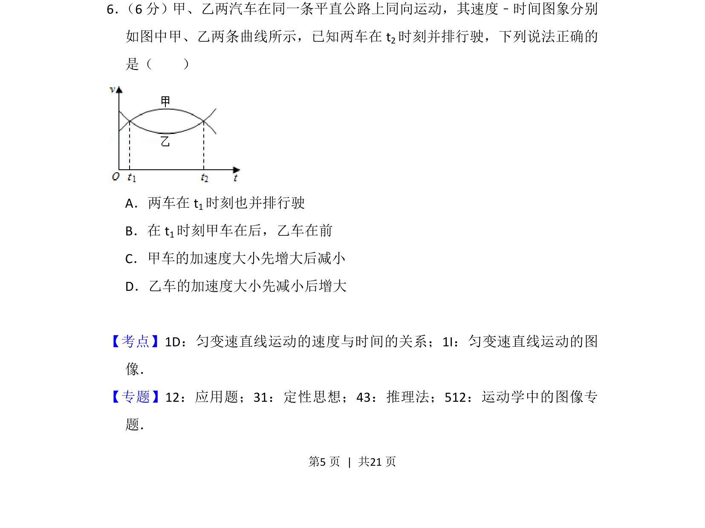
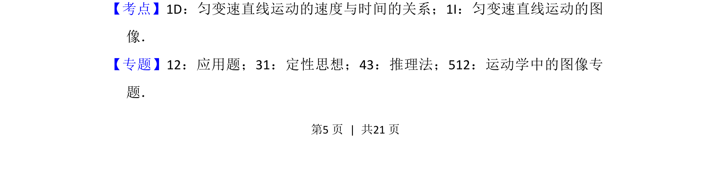
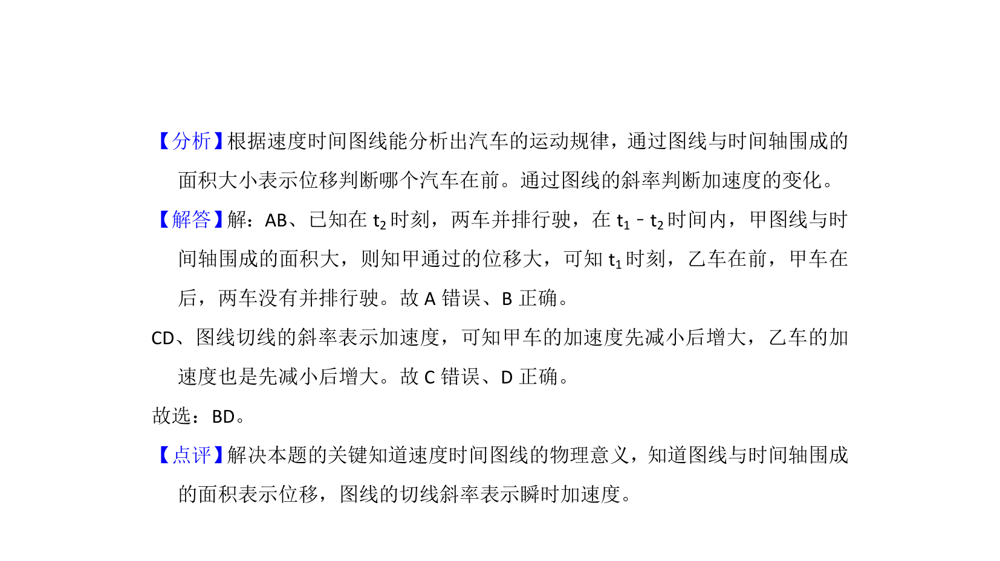

## 题面

## 摘要

两车速度-时间图象分析，根据图象判断并排行驶时刻、前后位置关系及加速度变化趋势

## 关联考点

- [[速度-时间图象]]
- [[215-匀变速直线运动|匀变速直线运动]]
- [[214-加速度|加速度]]

## 答案与解析

> 📄 原 PDF 第 5 页：`素材/真题/吉林/2008-2024·（吉林）物理高考真题/2018年高考物理试卷（新课标Ⅱ）（解析卷）.pdf`
