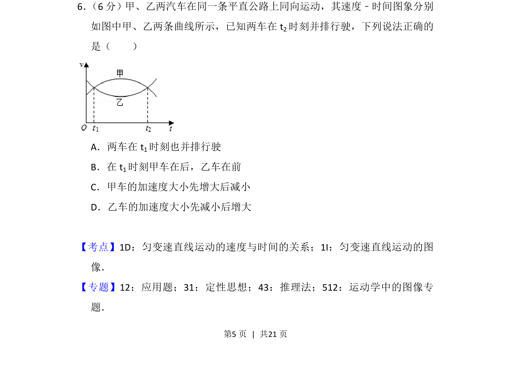
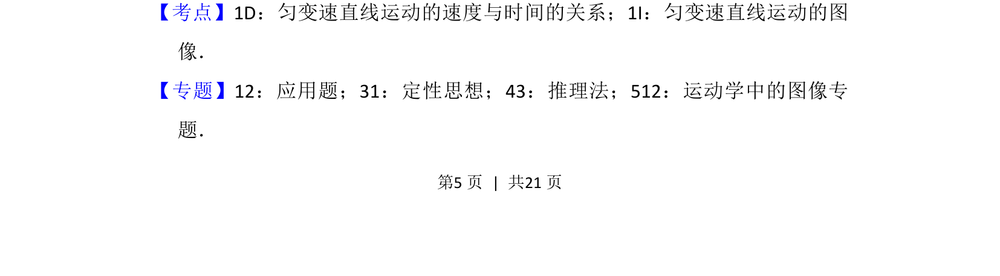
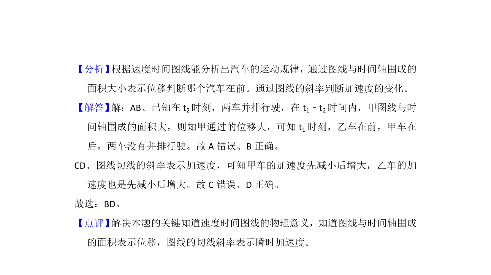

## 题面

## 摘要

两车速度-时间图象分析，根据图象判断并排行驶时刻、前后位置关系及加速度变化趋势

## 关联考点

- [[242-速度时间图象|速度-时间图象]]
- [[215-匀变速直线运动|匀变速直线运动]]
- [[214-加速度|加速度]]

## 答案与解析

> 📄 原 PDF 第 5 页：`素材/真题/吉林/2008-2024·（吉林）物理高考真题/2018年高考物理试卷（新课标Ⅱ）（解析卷）.pdf`

<!-- 题干文本-start -->
## 题干文本
6． （6分）甲、乙两汽车在同一条平直公路上同向运动，其速度﹣时间图象分别
如图中甲、乙两条曲线所示，已知两车在t 2时刻并排行驶，下列说法正确的
是（　　）
A．两车在t 1时刻也并排行驶
B．在t 1时刻甲车在后，乙车在前
C．甲车的加速度大小先增大后减小
D．乙车的加速度大小先减小后增大
<!-- 题干文本-end -->

<!-- 解析文本-start -->
## 解析文本
【考点】1D：匀变速直线运动的速度与时间的关系；1I：匀变速直线运动的图
像．菁优网版权所有
【专题】12：应用题；31：定性思想；43：推理法；512：运动学中的图像专
题．
<!-- 解析文本-end -->
