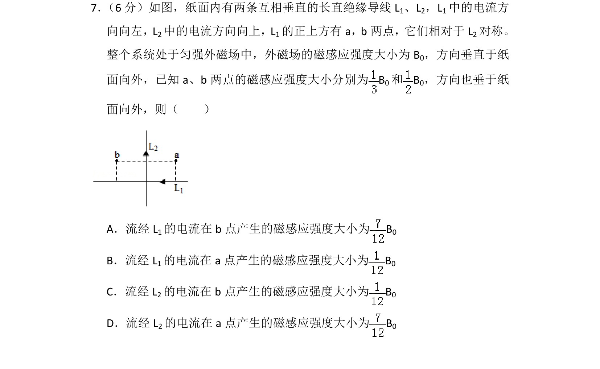
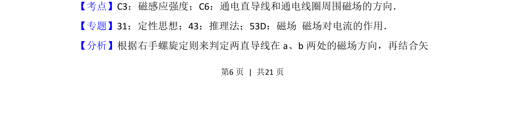
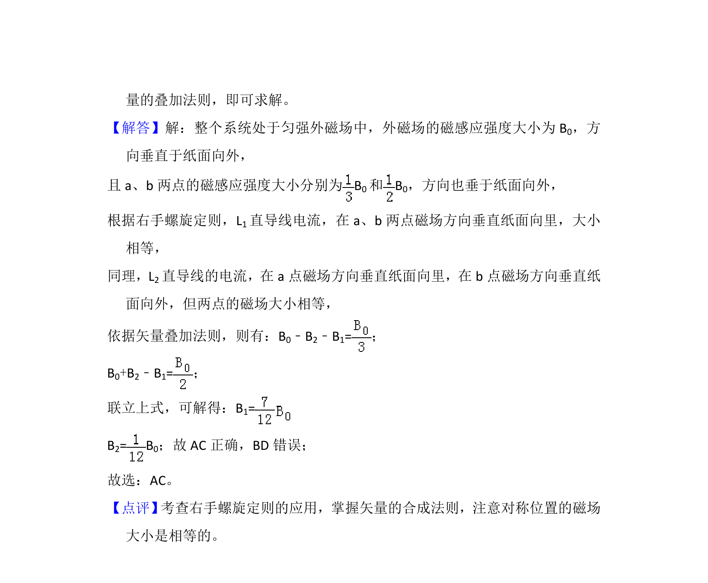

## 题面

## 摘要

考查通电直导线周围磁场叠加，结合右手定则分析空间磁感应强度矢量和。

## 关联考点

- [[323-磁感应强度|磁感应强度]]
- [[742-通电直导线磁场方向|通电直导线磁场方向]]
- [[702-矢量和|矢量和]]

## 答案与解析

> 📄 原 PDF 第 6 页：`素材/真题/吉林/2008-2024·（吉林）物理高考真题/2018年高考物理试卷（新课标Ⅱ）（解析卷）.pdf`
